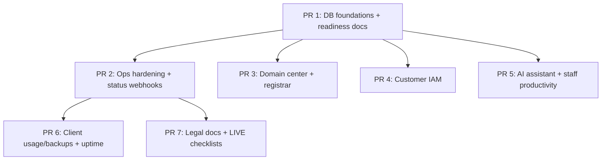

# LIVE Release Runbook — staging rehearsal i produkcja

Data przygotowania: 2026-05-18

Cel: uporządkować obecny duży zakres zmian do bezpiecznego wdrożenia 100% LIVE, bez MVP, mocków ani niejawnych braków funkcji.

## 1. Proponowany podział PR/commitów

Nie wykonywać jeszcze branchowania/push/PR bez akceptacji splitu. Aktualny worktree jest duży i zawiera kilka niezależnych obszarów; rekomendowany split:



### PR 1 — DB foundations + environment surface

Zakres:

- `libs/database/prisma/schema.prisma`
- `libs/database/prisma/migrations/20260518122000_customer_iam_live/`
- `libs/database/prisma/migrations/20260518123000_domain_registrar_live/`
- `libs/database/prisma/migrations/20260518124000_ai_live/`
- `apps/api/.env.example`
- wspólne app wiring: `apps/api/src/app.module.ts`

Weryfikacja:

```bash
pnpm --filter @verris/database db:generate
pnpm typecheck
```

Uwagi LIVE:

- Migracje są wymagane przed deployem API.
- `APP_KMS_KEY` musi być stałe między wdrożeniami, bo szyfruje sekrety IAM/rejestratora/migracji.

### PR 2 — Ops hardening + status webhooks + NOC

Zakres:

- `apps/api/src/status/*`
- `apps/api/src/product-ops/*`
- `apps/api/src/observability/metrics.service.ts`
- `apps/admin-panel/src/app/(dashboard)/product-ops/*`
- testy status webhooków

Weryfikacja:

```bash
pnpm --filter api test -- status-webhook
pnpm --filter api build
```

Uwagi LIVE:

- Webhooki akceptują tylko publiczne `https://` URL-e.
- Endpointy prywatne, localhost i adresy reserved są blokowane.
- Delivery scheduler ma lease, żeby wiele instancji API nie wysyłało tego samego delivery równolegle.

### PR 3 — Domain center + registrar

Zakres:

- `apps/api/src/domains/*`
- `apps/client-panel/src/app/dashboard/domains/**`
- `apps/client-panel/src/app/dashboard/domains/registrar/**`
- testy `domain-registrar.service.spec.ts`, `domains.service.spec.ts`

Weryfikacja:

```bash
pnpm --filter api test -- domains
pnpm typecheck
```

Uwagi LIVE:

- Bez `REGISTRAR_API_BASE_URL` i `REGISTRAR_API_TOKEN` rejestrator działa fail-closed (`503`), nie symuluje zakupu.
- Przed publicznym włączeniem sprzedaży domen wymagany jest sandbox/production contract konkretnego rejestratora.

### PR 4 — Customer IAM

Zakres:

- `apps/api/src/users/customer-iam.*`
- `apps/api/src/common/decorators/customer-permissions.decorator.ts`
- `apps/api/src/common/guards/customer-permissions.guard.ts`
- `apps/api/src/auth/*`
- `apps/client-panel/src/app/dashboard/iam/**`
- `apps/client-panel/src/app/accept-invite/**`

Weryfikacja:

```bash
pnpm --filter api test -- customer-iam
pnpm typecheck
```

Uwagi LIVE:

- Subkonto działa w kontekście ownera, ale `principalUserId` zostaje zachowany dla audytu.
- Tylko owner może zarządzać IAM.
- Guard subkont ogranicza dostęp do billing/services/domains/DNS/email/files/tickets/settings.

### PR 5 — AI assistant + staff productivity

Zakres:

- `apps/api/src/ai/**`
- `apps/staff-panel/src/components/ticket-detail-panel.tsx`
- `apps/staff-panel/src/lib/ticket-actions.ts`
- `apps/staff-panel/src/app/(dashboard)/crm/[userId]/page.tsx`
- `apps/staff-panel/src/lib/crm-profile-data.ts`

Weryfikacja:

```bash
pnpm --filter api test -- ai-provider
pnpm typecheck
```

Uwagi LIVE:

- Bez `AI_API_KEY` AI działa fail-closed (`503`), bez fallbacku/mocków.
- AI nie wysyła nic automatycznie do klienta; operator widzi draft/checklistę.
- Interakcje są logowane w `AiInteractionLog` i audycie.

### PR 6 — Client usage, backup preview, uptime badge, migration workers

Zakres:

- `apps/api/src/subscriptions/*`
- `apps/client-panel/src/app/dashboard/backups/page.tsx`
- `apps/client-panel/src/app/dashboard/hosting-tools-data.ts`
- `apps/client-panel/src/app/dashboard/services/**`
- `apps/client-panel/src/components/hosting/UsageTab.tsx`
- testy migration worker / uptime badge

Weryfikacja:

```bash
pnpm --filter api test -- migration-orchestrator
pnpm --filter api test -- public-uptime-badge
pnpm build
```

Uwagi LIVE:

- Restore preview bazuje na realnej liście backupów DA i aktualnym inventory konta.
- Migration worker lease jest atomowy.
- Surowe błędy DA nie są pokazywane klientowi.

### PR 7 — Legal docs + operational readiness docs

Zakres:

- `LIVE_READINESS_PLAN.md`
- `LIVE_PRODUCT_SCOPE_DECISION.md`
- `LEGAL_LIVE_INPUTS.md`
- `DEPLOY.md`
- `OPERATIONAL_CHECKLIST.md`
- `PROD_HEALTH_CHECKLIST.md`
- `PROJECT_STATUS.md`
- `SPRINT_PLAN.md`
- `docs/legal/drafts/**`

Weryfikacja:

```bash
pnpm typecheck
pnpm build
```

Uwagi LIVE:

- Blokery zewnętrzne: subprocessors, publiczne URL-e dokumentów, review prawne.
- Dokumenty nie zawierają TODO dla danych HVLN, ale nadal wymagają potwierdzenia dostawców.

## 2. Snapshot przed dzieleniem zmian

Przed fizycznym splitowaniem branchy/commitów zapisać recoverable snapshot:

```bash
SHA=$(git stash create "pre-live-split")
if [ -n "$SHA" ]; then
  git update-ref "refs/backup/pre-live-split-$(date +%s)" "$SHA"
fi
```

Nie używać:

```bash
git add .
git add -A
git reset --hard
git clean -fdx
```

Commitować tylko nazwane pliki dla danego PR-a.

## 3. Staging rehearsal

### 3.1. Preflight lokalny

Uruchomić przed deployem staging:

```bash
pnpm --filter @verris/database db:generate
pnpm --filter api test
pnpm typecheck
pnpm build
```

Oczekiwane:

- API tests: wszystkie suites green.
- `pnpm typecheck`: 0 błędów.
- `pnpm build`: 0 błędów. Ostrzeżenia `status-page fetch failed` podczas prerenderu są akceptowalne tylko jeśli build kończy się sukcesem i staging API przejdzie healthcheck.

### 3.2. Env staging

Minimalny zestaw dla staging:

```bash
NODE_ENV=production
PUBLIC_API_URL=https://api-staging.verris.pl
CLIENT_PANEL_URL=https://panel-staging.verris.pl
ADMIN_PANEL_URL=https://admin-staging.verris.pl
STAFF_PANEL_URL=https://staff-staging.verris.pl
STATUS_PAGE_URL=https://status-staging.verris.pl

POSTGRES_PASSWORD=<secret>
DATABASE_URL=
REDIS_URL=redis://redis:6379/0

JWT_SECRET=<openssl rand -base64 64>
JWT_EXPIRES_IN=1d
APP_KMS_KEY=<openssl rand -base64 64>

S3_ENDPOINT=http://minio:9000
S3_ACCESS_KEY=<staging-access-key>
S3_SECRET_KEY=<secret>
S3_REGION=eu-central-1
S3_USE_SSL=false
S3_PATH_STYLE=true

SMTP_HOST=127.0.0.1
SMTP_PORT=25
SMTP_SECURE=none
SMTP_FROM_ADDRESS=panel@verris.pl
SMTP_FROM_NAME=Verris

METRICS_AUTH_TOKEN=<openssl rand -hex 32>

# Fail-closed unless provider sandbox is ready:
REGISTRAR_PROVIDER=http
REGISTRAR_API_BASE_URL=
REGISTRAR_API_TOKEN=

AI_PROVIDER=openai-compatible
AI_API_BASE_URL=https://api.openai.com/v1
AI_API_KEY=
AI_MODEL=gpt-4o-mini
```

Jeśli testujemy sandbox rejestratora/AI, uzupełnić `REGISTRAR_*` i `AI_API_KEY` wyłącznie stagingowymi wartościami.

### 3.3. Deploy staging

```bash
git fetch origin
git checkout <release-branch>
pnpm install --frozen-lockfile
pnpm --filter @verris/database db:generate
pnpm --filter api test
pnpm typecheck
pnpm build

docker compose -f docker-compose.prod.yml --env-file .env.staging up -d --build
./ops/scripts/prod-migrate-deploy.sh
docker compose -f docker-compose.prod.yml --env-file .env.staging ps
```

Healthcheck:

```bash
curl -fsS https://api-staging.verris.pl/healthz
curl -fsS https://api-staging.verris.pl/readyz
curl -fsS https://status-staging.verris.pl/api/health
```

## 4. Staging smoke tests

### 4.1. IAM

- [ ] Owner loguje się do panelu klienta.
- [ ] Owner otwiera `/dashboard/iam`.
- [ ] Owner wysyła zaproszenie na testowy e-mail.
- [ ] Link `/accept-invite?token=...` aktywuje subkonto.
- [ ] Subkonto loguje się poprawnie.
- [ ] Subkonto bez `BILLING_MANAGE` nie może wykonać operacji billingowej.
- [ ] Subkonto z `DOMAINS_READ` widzi domeny, ale bez `DOMAINS_MANAGE` nie wykonuje zmian.
- [ ] Owner wyłącza subkonto.
- [ ] Wyłączone subkonto nie przechodzi JWT validate.
- [ ] Audit zawiera `CUSTOMER_IAM_INVITE_CREATED`, `CUSTOMER_IAM_INVITE_ACCEPTED`, `CUSTOMER_IAM_MEMBER_DISABLED`.

### 4.2. Rejestrator domen

Bez providera:

- [ ] `/dashboard/domains/registrar` renderuje się.
- [ ] API availability/register zwraca `503 Registrar provider is not configured.`
- [ ] UI nie komunikuje udanego zamówienia.

Z sandbox providerem:

- [ ] Availability dla domeny testowej działa.
- [ ] Niedostępna domena blokuje register.
- [ ] Register tworzy `DomainRegistrarOrder` i `Domain`.
- [ ] Transfer zapisuje `authCodeEnc`, nie pokazuje kodu w UI ani audycie.
- [ ] Renew tworzy zamówienie `RENEW`.

### 4.3. AI

Bez klucza:

- [ ] Staff ticket AI suggestion zwraca kontrolowane `503 AI provider is not configured.`
- [ ] Nie powstaje fałszywa sugestia.

Z kluczem staging:

- [ ] Staff generuje sugestię w tickecie.
- [ ] Odpowiedź jest JSON draft/checklist, nie wysyła się do klienta.
- [ ] Powstaje `AiInteractionLog`.
- [ ] Audit zawiera `AI_ASSISTANT_USED`.
- [ ] Prompt nie ujawnia sekretów, e-maili ani numerów wrażliwych wprost.

### 4.4. Ops hardening

- [ ] Status webhook na `http://...` jest odrzucony.
- [ ] Status webhook na `https://localhost/...` jest odrzucony.
- [ ] Status webhook na publiczny `https://` endpoint jest zapisany.
- [ ] Delivery ma HMAC, delivery id i event headers.
- [ ] Dwa równoległe schedulery nie wysyłają tego samego delivery.
- [ ] Anomaly board nie pokazuje emaili klientów ani surowych błędów.

### 4.5. Backup preview / usage / migration worker

- [ ] Backup preview pokazuje realny backup DA.
- [ ] Restore scope pokazuje inventory: files/domains/databases/mailboxes.
- [ ] Błędy DA są sanityzowane dla klienta.
- [ ] Usage tab ładuje realne `UsageMetric`.
- [ ] Migration worker leasing zwraca jeden job na jeden claim.
- [ ] Completion worker job aktualizuje counters i finalizuje request dopiero po wszystkich jobach.

### 4.6. Legal / compliance

- [ ] Drafty legal mają dane HVLN.
- [ ] Brak publicznych TODO w opublikowanych dokumentach.
- [ ] Subprocessors potwierdzeni albo funkcje zależne pozostają niewłączone publicznie.
- [ ] Publiczne URL-e terms/privacy/cookies/DPA ustawione przed LIVE.

## 5. Produkcyjny go/no-go

GO tylko jeśli:

- [ ] `pnpm --filter api test`, `pnpm typecheck`, `pnpm build` przechodzą na release branchu.
- [ ] Staging rehearsal wykonany bez blockerów.
- [ ] Backup DB i MinIO działa oraz wykonano test odtworzenia na staging.
- [ ] `.env.prod` ma `chmod 600` i nie zawiera wartości testowych.
- [ ] `APP_KMS_KEY` jest zapisany w managerze sekretów i nie zostanie zgubiony.
- [ ] Stripe live/webhook działa.
- [ ] SMTP wysyła maile transakcyjne.
- [ ] S3/MinIO buckety istnieją i API nie używa root credentials.
- [ ] Status webhooks ustawione tylko na publiczne HTTPS.
- [ ] Rejestrator i AI mają providerów produkcyjnych albo zostają fail-closed.
- [ ] Legal: subprocessors, publiczne URL-e i review prawne są potwierdzone.

NO-GO jeśli:

- [ ] Brak migracji DB dla aktualnego schema.
- [ ] Jest jakikolwiek mock/stub widoczny dla klienta jako działająca funkcja.
- [ ] AI lub rejestrator ma udawać działanie bez providera.
- [ ] W UI klienta widać surowe błędy DA/API.
- [ ] Brak rollback planu lub backupu przed deployem.

## 6. Produkcyjne komendy deploy

Na serwerze produkcyjnym:

```bash
cd /opt/verris
git fetch origin
git checkout <approved-release-tag-or-branch>
git pull --ff-only

pnpm install --frozen-lockfile
pnpm --filter @verris/database db:generate
pnpm --filter api test
pnpm typecheck
pnpm build

docker compose -f docker-compose.prod.yml --env-file .env.prod pull || true
docker compose -f docker-compose.prod.yml --env-file .env.prod up -d --build

# WAŻNE: migracje dopiero po `--build api` — `migrate deploy` czyta pliki z obrazu API.
# Uruchomienie migrate przed rebuildem zgłosi „No pending migrations”, a nowe kolumny nie powstaną.
./ops/scripts/prod-migrate-deploy.sh

docker compose -f docker-compose.prod.yml --env-file .env.prod ps
docker compose -f docker-compose.prod.yml --env-file .env.prod logs --tail=200 api
```

Healthcheck produkcyjny:

```bash
curl -fsS https://api.verris.pl/healthz
curl -fsS https://api.verris.pl/readyz
curl -fsS https://status.verris.pl/api/health
curl -fsS https://panel.verris.pl/login
curl -fsS https://admin.verris.pl/login
curl -fsS https://staff.verris.pl/login
```

Po deployu:

- [ ] Sprawdzić logi API przez 15 minut.
- [ ] Sprawdzić `/metrics` z Prometheusa.
- [ ] Sprawdzić Grafanę i alerty.
- [ ] Wykonać smoke test owner/subkonto.
- [ ] Wykonać test status webhook na endpoint kontrolny.
- [ ] Wykonać test backup preview na koncie testowym.

## 7. Rollback

Rollback aplikacji:

```bash
cd /opt/verris
git checkout <previous-known-good-tag>
docker compose -f docker-compose.prod.yml --env-file .env.prod up -d --build
docker compose -f docker-compose.prod.yml --env-file .env.prod logs --tail=200 api
```

Rollback DB:

- Prisma migrations są forward-only.
- Jeśli migracja została wykonana i trzeba cofnąć dane, użyć snapshotu DB sprzed deploya.
- Przed deployem produkcyjnym wykonać:

```bash
docker compose -f docker-compose.prod.yml --env-file .env.prod exec postgres \
  pg_dump -U "$POSTGRES_USER" -d "$POSTGRES_DB" -Fc > "backup-before-live-$(date +%Y%m%d%H%M).dump"
```

Rollback feature-level:

- Rejestrator: wyczyścić `REGISTRAR_API_BASE_URL` / `REGISTRAR_API_TOKEN` i zrestartować API. Endpointy przejdą w fail-closed.
- AI: wyczyścić `AI_API_KEY` i zrestartować API. Endpointy przejdą w fail-closed.
- Status webhooks: dezaktywować endpointy w admin NOC albo w DB ustawić `isActive=false`.
- IAM: wyłączyć konkretne subkonto przez ownera lub DB `subaccountDisabledAt=now()` tylko awaryjnie.

## 8. Autoskalowanie — ręczny shrink dysku / RAM / CPU (support)

Gdy klient wyłączył autoskalowanie lub zmniejszył limit, delta może pozostać na koncie do czasu, aż silnik ją zdejmie przy niskiej presji. Support może wymusić powrót do limitów planu:

1. W CRM / panelu staff znajdź subskrypcję i konto (`daUsername`, `domain`).
2. Zweryfikuj w DB: `Account.scaledCpu`, `scaledRamMb`, `scaledDiskMb` oraz efektywne `cpuLimit`, `ramLimitMb`, `diskLimitMb`.
3. Porównaj z `Plan.*Limit*` — docelowe limity DA = wartości planu (bez delty).
4. Na węźle DirectAdmin (przez istniejący `DirectAdminService` / panel admina serwera) ustaw quota i LVE na wartości planu:
   - CPU: `plan.cpuLimit`
   - RAM: `plan.ramLimitMb`
   - Dysk (quota MB): `plan.diskLimitMb`
5. W Postgres (tylko po potwierdzeniu DA):

```sql
UPDATE "Account"
SET "scaledCpu" = 0, "scaledRamMb" = 0, "scaledDiskMb" = 0,
    "cpuLimit" = <plan_cpu>, "ramLimitMb" = <plan_ram>, "diskLimitMb" = <plan_disk>
WHERE "id" = '<account_id>';
```

6. Zapisz wpis w audycie / tickecie: powód (np. klient prosił o shrink, błąd autoskalowania).
7. Poinformuj klienta, że kolejne naliczenia autoskalowania spadną po zerowej delcie (billing godzinowy).

**Nie** zmniejszaj dysku poniżej faktycznego zużycia bez sprawdzenia `UsageMetric.diskUsageMb` — ryzyko awarii aplikacji.

## 8.1 Zmiana planu (PC-1 / PC-2) — deploy i weryfikacja

**Migracja:** `20260520140000_wallet_plan_change_types` (enum `CHARGE_PLAN_UPGRADE`, `CREDIT_PLAN_DOWNGRADE`).

**Kolejność (jak przy AS-2):**

```bash
git pull
docker compose -f docker-compose.prod.yml --env-file .env.prod up -d --build api client-panel
bash ops/scripts/prod-migrate-deploy.sh
```

**Smoke test (klient, ACTIVE + konto DA):**

1. `/dashboard/services` → ikona zmiany planu (tylko ACTIVE).
2. `/dashboard/services/<id>/plan` → wybór planu → podgląd proration → potwierdzenie.
3. API: `POST /subscriptions/:id/plan/preview`, `PATCH /subscriptions/:id/plan`.
4. DB: `Subscription.planId`, `priceAmount`, `SubscriptionEvent` typ `PLAN_CHANGED`, `Account.scaled*` = 0, limity = plan.
5. Portfel (WALLET): transakcja `CHARGE_PLAN_UPGRADE` lub `CREDIT_PLAN_DOWNGRADE`.
6. Stripe (STRIPE_CARD): faktura/proration w Stripe; lokalny okres zsynchronizowany z webhookiem.

**Awaria DA przy commit:** API nie zapisuje planu w DB jeśli `setAccountLimits` się nie powiedzie (rollback portfela przy WALLET upgrade).

## 9. Otwarte decyzje przed LIVE

- [ ] Wybrać i zakontraktować rejestratora domen, potwierdzić API register/transfer/renew/nameservers.
- [ ] Potwierdzić AI provider, DPA/subprocessor i politykę retencji promptów.
- [ ] Potwierdzić subprocessors: hosting, backup, SMTP/mail, płatności, AI, rejestrator.
- [ ] Ustawić publiczne URL-e: regulamin, privacy, cookies, DPA.
- [ ] Potwierdzić review prawne dokumentów.
- [ ] Zdecydować, czy rejestrator i AI są włączane na start LIVE, czy zostają fail-closed jako funkcje ukryte/operacyjne.
