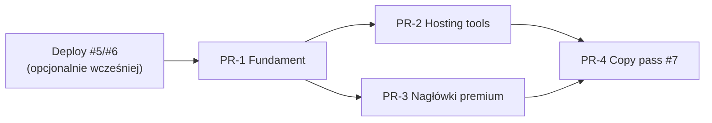

# Panel klienta — plan ujednolicenia UX (4 PR + copy pass)

> **Cel:** spójny wygląd, lepsza nawigacja na mobile i język klienta (bez mieszania stylów i bez „technicznego” DirectAdmin/LVE w pierwszej linii UI).  
> **Zasada:** każdy PR jest **gotowy do LIVE** w swoim obszarze — bez półekranowych placeholderów.  
> **Deploy #5/#6 (kafelki sidebar + domeny):** można wdrożyć **przed** lub **razem z PR-1**; nie blokuje tego planu.

---

## Decyzje projektowe (jednorazowo)

| Temat | Decyzja | Uzasadnienie |
|--------|---------|--------------|
| Karta treści hosting tools | **`PanelCard`** (bez `SpinBorder` na każdej podstronie) | SpinBorder zostaje na dashboardzie, portfelu, supportcie i **domenach** (już wdrożone). Hosting tools = częste odświeżanie list — prostsza karta = mniej szumu wizualnego. |
| Nagłówek strony | **`PanelPageHeader` + `PageActions`** | Jedna skala typografii (`text-2xl sm:text-3xl`), bez gradientów na tytułach. |
| Tabele na mobile | **`ResponsiveDataView`** | Wzorzec z domen: `md:hidden` karty + `hidden md:block` tabela. |
| Modale (dodawanie / potwierdzenie) | **`PanelModal`** (opcjonalnie w PR-1) | `items-end` + `rounded-t-2xl` na mobile, wyśrodkowany na `sm+` — jak naprawione na domenach. |
| Eksport komponentów | `apps/client-panel/src/components/panel/` | `index.ts` re-eksport; import `@/components/panel`. |

### Tokeny wizualne (wspólne klasy)

- Strona: `space-y-6 animate-in fade-in slide-in-from-bottom-4 duration-500`
- Nagłówek opisu: `text-sm text-muted-foreground md:text-base`
- Karta: `PanelCard` → `rounded-2xl border border-white/10 bg-[#0a0a0a]/80`
- Empty: `PanelEmptyState` (ikona + tytuł + opis + opcjonalny CTA)
- Błąd fetchu: `PanelFetchError` (amber/rose spójnie z resztą panelu)

---

## Kolejność i zależności



| PR | Blokuje | Można równolegle |
|----|---------|------------------|
| PR-1 | PR-2, PR-3 | Deploy #5/#6 |
| PR-2 | — | PR-3 (po PR-1) |
| PR-3 | — | PR-2 (po PR-1) |
| PR-4 | — | najlepiej po PR-2+PR-3 |

**Branching:** `feat/panel-ux-1-foundation` → `feat/panel-ux-2-hosting` → `feat/panel-ux-3-headers` → `feat/panel-ux-4-copy` (każdy PR do `live-release-readiness` lub `main` według aktualnego flow release).

---

## PR-1 — Fundament komponentów panelu

**Tytuł PR:** `feat(client-panel): panel layout primitives (header, actions, responsive data)`

### Zakres

1. **Rozbudowa `panel-shell.tsx`**
   - `PanelPageHeader` — już istnieje; dodać opcjonalny `actions?: ReactNode` slot (alternatywa: osobny wrapper).
   - **`PageActions`** — `flex w-full flex-col gap-2 sm:w-auto sm:flex-row`; dzieci = przyciski/linki.
   - **`PageHeaderRow`** — składa `PanelPageHeader` + `PageActions` w responsywny wiersz (`flex-col gap-4 sm:flex-row sm:items-start sm:justify-between`).
   - **`PanelEmptyState`**, **`PanelFetchError`** — wyciągnięte z powtarzających się wzorów.
   - **`PanelModal`** — backdrop + sheet/center (props: `open`, `onClose`, `title`, `description`, `children`).
   - **`ResponsiveDataView<T>`** — generyczny API (poniżej).

2. **`ResponsiveDataView` — API**

```tsx
type Column<T> = {
  key: string;
  header: string;
  className?: string;
  cell: (row: T) => React.ReactNode;
};

type ResponsiveDataViewProps<T> = {
  rows: T[];
  rowKey: (row: T) => string;
  columns: Column<T>[];
  renderMobileCard: (row: T) => React.ReactNode;
  empty?: React.ReactNode;
  tableClassName?: string;
};
```

- Desktop: `<table>` w `hidden md:block overflow-x-auto`.
- Mobile: `md:hidden space-y-3` + `renderMobileCard`.
- **Nie** zastępuje złożonych tabel z dropdownami w pierwszej iteracji — domeny mogą zostać na custom UI do PR-2 (refactor opcjonalny).

3. **Pilotaż PR-1 (minimalny diff stron)**

| Plik | Zmiana |
|------|--------|
| `domains/page.tsx` | Zamiana nagłówka na `PageHeaderRow`; opcjonalnie modal → `PanelModal` |
| `dns/page.tsx` | `PageHeaderRow` + `ResponsiveDataView` dla rekordów DNS |
| `ftp/page.tsx` | j.w. dla kont FTP |

**Cel pilotażu:** zweryfikować API na 3 stronach przed masową migracją w PR-2.

4. **Pliki nowe / zmienione**

```
apps/client-panel/src/components/panel/
  panel-shell.tsx          # rozszerzenie
  page-header-row.tsx      # nowy
  page-actions.tsx         # nowy
  responsive-data-view.tsx # nowy
  panel-modal.tsx          # nowy
  panel-empty.tsx          # nowy
  index.ts                 # nowy
```

5. **Testy / jakość**

- `pnpm --filter @verris/client-panel typecheck`
- Brak testów jednostkowych UI (zgodnie z konwencją repo) — **checklist manualna** (poniżej).
- Storybook: **nie** w scope (brak w projekcie).

### Kryteria DONE (PR-1)

- [ ] Wszystkie nowe komponenty eksportowane z `@/components/panel`
- [ ] DNS i FTP: na viewport 375px widać karty, na ≥768px tabela — bez poziomego scrolla jako jedynej opcji
- [ ] Nagłówek DNS/FTP/domeny: przyciski pod tytułem na mobile
- [ ] Zero regresji typecheck

### Checklist manualna PR-1

- [ ] iPhone/Android width: DNS, FTP, domeny — nagłówek + lista
- [ ] Desktop: te same strony — tabela + tabs
- [ ] Modal domeny (jeśli `PanelModal`): zamknięcie backdrop, focus w polu

---

## PR-2 — Hosting tools (HostingPageWrapper + PanelCard)

**Tytuł PR:** `feat(client-panel): unify hosting tools layout and mobile lists`

### Zakres

1. **`HostingPageWrapper`** (`hosting-tabs.tsx`)

Rozszerzyć istniejący wrapper:

```tsx
HostingPageWrapper({
  title,
  description,
  currentTab,
  serviceId?,
  dnsZone?,
  actions?,        // PageActions children
  children,
})
```

- Wewnątrz: `PageHeaderRow` → `HostingTabs` → `children` w `PanelCard`.
- Usunąć zduplikowane `<header>` z każdej podstrony.

2. **Migracja stron z `HostingTabs`** (10 plików)

| Plik | Uwagi |
|------|--------|
| `dns/page.tsx` | Już częściowo w PR-1 — dokończyć wrapper + `PanelCard` |
| `ftp/page.tsx` | j.w. |
| `databases/page.tsx` | Lista kart już OK — tylko wrapper + copy w PR-4 |
| `email/page.tsx` | j.w. |
| `cron/page.tsx` | j.w. |
| `ssl/page.tsx` | Formularze SSL w `PanelCard`; lista certyfikatów bez zmian struktury |
| `file-manager/page.tsx` | Link do DA w karcie |
| `backups/page.tsx` | Przycisk backup + lista |
| `migrations/page.tsx` | Formularz + timeline |
| `domains/page.tsx` | **Wyjątek:** zostaje SpinBorder + własny layout (główna strona produktowa domen); tylko nagłówek może użyć `PageHeaderRow` jeśli nie zrobiono w PR-1 |

3. **Faktury (`billing/invoices/page.tsx`)**

- `PageHeaderRow` (link „Wróć do portfela” w `actions` lub nad nagłówkiem)
- `ResponsiveDataView` dla wierszy faktur
- Karta listy: `PanelCard` lub istniejący `rounded-3xl` — **ujednolicić do `PanelCard`**
- Paginacja: na mobile `flex-col gap-3` (tekst nad przyciskami)

4. **Wspólny stan „brak usługi”**

Wyciągnąć do `HostingNoServiceState({ serviceId? })` — ten sam komunikat co dziś na DNS/FTP/…

5. **Nie w scope PR-2**

- `domains/[id]/page.tsx` — osobny follow-up (layout szczegółów domeny)
- Komponenty w `src/components/hosting/*Tab.tsx` używane w widoku usługi `[id]` — osobny PR po hosting tools

### Kryteria DONE (PR-2)

- [ ] Wszystkie strony z `HostingTabs` (oprócz wyjątku domen) używają `HostingPageWrapper`
- [ ] Jednolita karta treści (`PanelCard`)
- [ ] DNS, FTP, faktury — mobile cards (PR-1 + dokończenie faktur)
- [ ] `pnpm typecheck` + build client-panel

### Checklist manualna PR-2

- [ ] Przejście całego paska `HostingTabs` na jednej usłudze (serviceId w URL)
- [ ] Brak usługi: komunikat spójny na każdej zakładce
- [ ] Faktury: paginacja i pobieranie PDF na mobile

---

## PR-3 — Nagłówki premium (bez gradientów)

**Tytuł PR:** `feat(client-panel): align services, support, billing headers with panel primitives`

### Zakres

| Plik | Było | Będzie |
|------|------|--------|
| `services/page.tsx` | Gradient `text-4xl`, `flex justify-between` | `PageHeaderRow` + CTA „Zamów usługę” |
| `support/page.tsx` | Gradient + własny przycisk | `PageHeaderRow`; SpinBorder na liście ticketów **zostaje** |
| `billing/invoices/page.tsx` | Gradient (jeśli jeszcze po PR-2) | Dokończenie spójności |
| `billing/page.tsx` | Częściowo SpinBorder | Tylko nagłówek sekcji → `PageHeaderRow` (bez przebudowy całego portfela) |
| `dashboard-home.tsx` | Własny hero | **Opcjonalnie:** tylko podtytuł bez gradientu na H1 — product decision w review |

**Zasada:** nie zmieniać logiki danych / kart usług — tylko warstwa nagłówka i spacing (`space-y-6` vs `space-y-8` → ujedolnicić do `space-y-6`).

### Kryteria DONE (PR-3)

- [ ] Brak `bg-gradient-to-r` / `text-transparent bg-clip-text` na H1 w services, support, invoices
- [ ] Wszystkie główne CTA w nagłówku mieszczą się na 320px szerokości bez nachodzenia na tytuł
- [ ] Wizualna zgodność z DNS/FTP po PR-2

### Checklist manualna PR-3

- [ ] Serwery: przycisk „Zamów” pod tytułem na mobile
- [ ] Support: „Nowe zgłoszenie” — to samo
- [ ] Spójność z dashboardem (nie musi być identyczna karta, ale ten sam rozmiar tytułu)

---

## PR-4 — Copy pass (#7)

**Tytuł PR:** `feat(client-panel): client-facing copy (hosting tools, billing, LVE)`

**Można zacząć równolegle po zamrożeniu API komponentów w PR-1** (osobny branch, merge po PR-2/3).

### Słownik (propozycja — do akceptacji produktowej)

| Było (techniczne) | Docelowo (klient) |
|-------------------|-------------------|
| DirectAdmin | panel hostingu / panel plików (kontekstowo) |
| subskrypcja / subskrypcji | usługa hostingowa / opłata cykliczna |
| LVE / CloudLinux LVE | limity zasobów serwera / autoskalowanie zasobów |
| użytkownik DA | login hostingowy |
| CMD_API_* | *(usunąć z UI klienta)* |
| Konto DA | konto hostingowe |
| Stripe (gdzie OK) | pozostawić przy płatnościach kartą |

### Pliki priorytetowe (fala 1 — widoczne w nawigacji)

```
apps/client-panel/src/app/dashboard/
  dns/page.tsx
  ftp/page.tsx
  email/page.tsx
  cron/page.tsx
  databases/page.tsx
  ssl/page.tsx
  file-manager/page.tsx
  backups/page.tsx
  migrations/page.tsx
  services/page.tsx
  services/new/form.tsx
  dashboard-home.tsx
  billing/page.tsx
  billing/invoices/page.tsx
  wallet-badge.tsx
  calculator/calculator.tsx
apps/client-panel/src/components/hosting/
  DomainsTab.tsx, DatabasesTab.tsx, SSLTab.tsx, DeployTab.tsx, ...
```

### Pliki fala 2 (widok usługi `[id]`, tabs)

```
apps/client-panel/src/app/dashboard/services/[id]/**
apps/client-panel/src/components/hosting/**
```

### Zasady copy

- Pierwsze zdanie opisu: **co klient zrobi**, nie skąd dane są pobierane.
- DirectAdmin tylko jako „Otwórz panel zaawansowany” z tooltipem — jeśli w ogóle.
- Zachować precyzję prawną w portfelu / fakturach (Stripe, e-mail potwierdzenia).

### Kryteria DONE (PR-4)

- [ ] Grep `DirectAdmin|LVE|CloudLinux|subskrypc` w `client-panel` — zero w user-facing stringach poza komentarzami / dev-only
- [ ] Przegląd przez osobę PL-native (Ty / product)
- [ ] Brak zmian w `apps/api` (tylko UI copy)

---

## Deploy i migracje

| Zmiana | Wymaga migracji DB | Serwisy |
|--------|-------------------|---------|
| PR-1–4 | **Nie** | tylko `client-panel` |
| #5 sidebar tiles (osobno) | **Tak** (`sidebarQuickLinks`) | `api` + `client-panel` |
| #6 domeny (osobno) | Nie | `client-panel` |

**Rekomendowany deploy produkcyjny:**

1. #5 + #6 (jeśli jeszcze nie na prod)
2. PR-1 → PR-2 → PR-3 → PR-4 (same rebuild `client-panel`)

---

## Szacunek nakładu

| PR | Pliki (orient.) | Nakład |
|----|-----------------|--------|
| PR-1 | ~8 nowych/zmienionych | 0.5–1 dzień |
| PR-2 | ~12 stron | 1–1.5 dnia |
| PR-3 | ~4 strony | 0.5 dnia |
| PR-4 | ~25–40 plików (głównie stringi) | 1–1.5 dnia |

---

## Ryzyka i mitigacje

| Ryzyko | Mitigacja |
|--------|-----------|
| Regresja layoutu na jednej zakładce hostingu | Checklist HostingTabs + screenshot PR |
| `ResponsiveDataView` za mało elastyczny dla faktur (akcje PDF) | `renderMobileCard` custom; kolumny tylko na desktop |
| Copy pass zmienia znaczenie prawne | Review faktur/portfela osobno; nie ruszać `legal/*` |
| Konflikt z otwartym PR #5/#6 | Merge foundation po sidebar/domeny lub rebase |

---

## Następny krok operacyjny

1. **Akceptacja** tego planu + słownika copy (PR-4).
2. **Implementacja PR-1** na branchu `feat/panel-ux-1-foundation`.
3. Równolegle: **deploy #5/#6** na prod (jeśli jeszcze nie).

Po akceptacji można od razu zacząć kod PR-1 w repozytorium.
