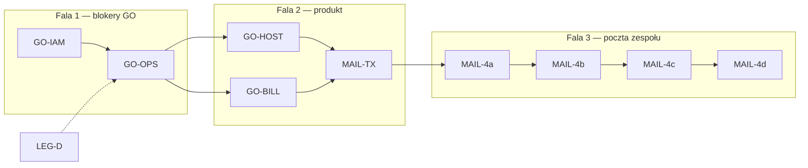

# Hosting LIVE — master backlog (źródło prawdy)

> **Ten plik = jedyna lista** do śledzenia: co zrobione, w toku, pomysły, nowe funkcje.  
> **Ostatnia aktualizacja:** 2026-05-24 · prod **`3109f31`** · właściciel backlogu: agent + Dominik  
> **Zasada GO:** [LIVE_PRODUCT_SCOPE_DECISION.md](../LIVE_PRODUCT_SCOPE_DECISION.md)

---

## Decyzje produktowe (zamknięte 2026-05-23)

| ID | Decyzja | Wpływ |
|----|---------|-------|
| **D-1** | **Subkonta IAM od startu** oferty | VER-11 / IAM smoke = **P0-BLK**; Regulamin §5a |
| **D-2** | Płatności: **tylko Stripe** (+ portfel K) | PayU/E-1 = P2, ukryte; Regulamin §7 |
| **D-3** | **Staging jest** — restore test tam (OPS-2) | Nie restore na prod z klientami |
| **D-4** | Agent przygotowuje drafty → Ty → prawnik → wgranie review | LEG-1 🔄, LEG-2 ⏸️ do prawnika |
| **D-5** | Alerty: **dominik@hvln.pl**; Slack przygotowany, włączyć później | [GRAFANA_ALERTING.md](./ops/GRAFANA_ALERTING.md) |

---

## Jak pracujemy z tym plikiem

| Status | Znaczenie |
|--------|-----------|
| ⏳ | Nie rozpoczęte |
| 🔄 | W toku |
| 🟡 | Częściowo |
| ✅ | Done (data + dowód w Uwagi) |
| ⏸️ | Wstrzymane (np. czeka na prawnika) |
| 💡 | Pomysł / backlog |

**Changelog:** … · **MAIL-3** mail-tester **10/10** (2026-05-24) · **MAIL-1b** nadawca Verris + panel@ (2026-05-24)

---

## Plan sprintów (od 2026-05-24)

> Szczegóły sprintów: [`PROPOSED_SPRINTS.md`](./PROPOSED_SPRINTS.md). Każdy merge = gotowy do LIVE w swoim zakresie.

| Sprint | Czas (szac.) | ID backlogu | Cel |
|--------|----------------|-------------|-----|
| **GO-IAM** | 3–5 d | VER-11, IAM-2 | Smoke subkont IAM na prod + mail zaproszenia |
| **GO-OPS** | 3–5 d | OPS-2, OPS-3, OPS-5, OPS-1, OPS-4 | Restore staging, alerty Grafana, smoke ops, GO checklist |
| **GO-HOST** | 5–7 d | HOST-1…4 | Węzeł compute, DA, provisioning, smoke operacji |
| **GO-BILL** | 3–5 d | BILL-1…2 | Stripe live, smoke portfel/checkout/faktury |
| **MAIL-TX** | 7–10 d | MAIL-2 | Maile transakcyjne LIVE ([`mail/AUDIT.md`](./mail/AUDIT.md) — auth, billing, IAM) |
| **MAIL-4a** | 5–7 d | MAIL-4 | Postfix virtual + Dovecot + UFW inbound |
| **MAIL-4b** | 5–7 d | MAIL-4 | Admin CRUD skrzynki + adresy systemowe |
| **MAIL-4c** | 5–7 d | MAIL-4 | Staff webmail + IMAP |
| **MAIL-4d** | 3–5 d | MAIL-4 | Aliasy, forwardy, import OVH, Rspamd |
| **LEG-D** | równolegle | LEG-1…6 | Drafty → prawnik → publikacja → re-consent |
| **OBS+** | po GO | OBS-1…5 | node_exporter, blackbox, host/docker — nie blokuje GO |

**Teraz (następny sprint):** **GO-IAM** — Ty: smoke [`IAM_SMOKE_PROD.md`](./IAM_SMOKE_PROD.md); agent: ewentualne poprawki po wyniku.

---

## Bieżący plan prac (agent)

| Krok | ID | Opis | Status |
|------|-----|------|--------|
| 1 | GO-IAM | VER-11 + IAM-2 | ✅ | Smoke 2026-05-24 PASS |
| 2 | GO-OPS | Restore, alerty, smoke, GO | ⏳ | Po IAM |
| 3 | GO-HOST / GO-BILL | Hosting + Stripe live | ⏳ | |
| 4 | MAIL-TX | Maile transakcyjne | ⏳ | Po GO-OPS |
| 5 | MAIL-4a…d | Poczta zespołu @verris.pl | ⏳ | [MAIL-4_CONTROL_PLANE_MAIL.md](./ops/MAIL-4_CONTROL_PLANE_MAIL.md) |
| 6 | LEG-D | Prawne | 🔄 / ⏸️ | Równolegle |
| 7 | OBS+ | Monitoring rozszerzony | 💡 | Po GO |

---

## P0-BLK — blokuje start hostingu

### Infrastruktura

| ID | Task | Status | Uwagi |
|----|------|--------|-------|
| INF-1 | Dysk root w progach | ✅ | 2026-05-23: 18% użycia, 60 GB wolne |
| INF-2 | Prune cache po deploy | ✅ | `prod-deploy-release.sh` |

### IAM (P0 — D-1)

| ID | Task | Status | Uwagi |
|----|------|--------|-------|
| VER-11 | Smoke prod IAM | ✅ | 2026-05-24 PASS — [`IAM_SMOKE_PROD.md`](./IAM_SMOKE_PROD.md) |
| IAM-2 | E-mail zaproszenia IAM | ✅ | Smoke: link + styl Verris |

### Operacje i GO

| ID | Task | Status | Uwagi |
|----|------|--------|-------|
| OPS-1 | PROD_HEALTH §1–12 bez ❌ | 🟡 | Dysk ✅ |
| OPS-2 | Restore test staging | ⏳ | dominik@hvln.pl |
| OPS-3 | Grafana → dominik@hvln.pl | 🟡 | Provisioning + GF_SMTP ✅; domknąć test alertu w UI (GO-OPS) |
| OPS-4 | GO_NO_GO odhaczone | ⏳ | |
| OPS-5 | Smoke SPRINT_0_OPS | ⏳ | |
| OPS-6 | PROD_HEALTH §12 | ⏳ | |

### HOST / BILL / LEG / MAIL

| ID | Task | Status | Uwagi |
|----|------|--------|-------|
| HOST-1…4 | Węzeł + DA + provisioning + operacja DA | ⏳ | Smoke |
| BILL-1…2 | Stripe live + smoke billing | ⏳ | Tylko Stripe (D-2) |
| LEG-1 | Drafty 0.2 | 🔄 | IAM, Stripe, subprocessors |
| LEG-2 | Lawyer review | ⏸️ | Gotowce → Ty → prawnik |
| LEG-3 | Publikacja admin | ⏳ | Po LEG-2 |
| LEG-4 | Re-consent smoke | ⏳ | |
| LEG-5…6 | Brak TODO, subprocessors | ⏳ | |
| MAIL-1 | SMTP: Postfix lokalny + opcjonalny relay w admin | ✅ | `441e279` — **Ustawienia → Poczta (SMTP)** |
| MAIL-1b | Nadawca: nazwa „Verris” + adres From w admin | ✅ | `mail.fromName` / `mail.fromAddress` w `platform_settings`; prod: `panel@verris.pl` |
| MAIL-2 | Min. maile LIVE (audyt triggerów) | ⏳ | Sprint **MAIL-TX** — [`mail/AUDIT.md`](./mail/AUDIT.md) |
| MAIL-3 | Postfix + SPF/DKIM/DMARC | ✅ | 2026-05-24: mail-tester **10/10**; [MAIL_DELIVERABILITY.md](./ops/MAIL_DELIVERABILITY.md) |
| MAIL-4 | Poczta zespołu @verris.pl (pełny zakres) | ⏳ | Spec: [MAIL-4_CONTROL_PLANE_MAIL.md](./ops/MAIL-4_CONTROL_PLANE_MAIL.md) |

---

## P0-VER — weryfikacja prod

| ID | Task | Status |
|----|------|--------|
| VER-1…3, VER-5…10, VER-12 | `.env`, migracje, DNS, Grafana SSO, backup, testy CI, linki UI | ⏳ / 🟡 |
| VER-4 | healthz + readyz | 🟡 |

---

## P1 / P2 / 💡

| ID | Task | Status | Uwagi |
|----|------|--------|-------|
| OBS-1…5 | Grafana host/blackbox/DB | 💡 | |
| BAK-1 | Mirror backup zewn. | 💡 | Faza 2 |
| BAK-2 | Slack alerty | ⏸️ | D-5 — doc w GRAFANA_ALERTING |
| E-1 | PayU/BLIK | 💡 | **Poza startem** (D-2) |
| E-2…6, PROD-* | Sprint E, BullMQ, AI, EKO | 💡 | |

---

## Pomysły (backlog 💡)

| ID | Pomysł |
|----|--------|
| IDEA-1 | Dashboard syntetyka paneli HTTP |
| IDEA-2 | Cotygodniowy health snapshot → mail |
| IDEA-3 | Auto-wpis PROD_HEALTH po deploy |

---

## Zamknięte (skrót)

Backup MinIO, Grafana SSO, IAM presety/audyt, Sprint W, W-03c, 0.3 UI, testy A, audyt B, INF-1, INF-2.

---

## Indeks źródeł

`LIVE_READINESS_PLAN`, `GO_NO_GO_PROD`, `PROD_HEALTH_CHECKLIST`, `LIVE_RELEASE_RUNBOOK`, `PROPOSED_SPRINTS`, `SPRINT_*`, `PROJECT_STATUS`, `DEPLOY`, `IAM_*`, `legal/drafts/`.
