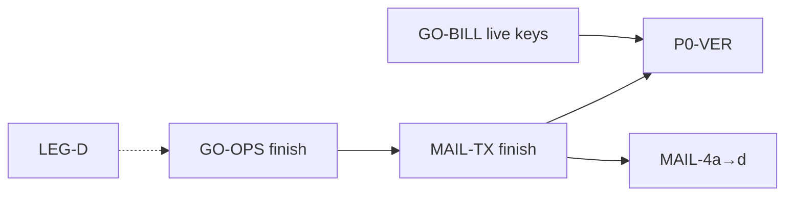

# Hosting LIVE — master backlog (źródło prawdy)

> **Ten plik = jedyna lista** do śledzenia: co zrobione, w toku, do zrobienia.  
> **Ostatnia aktualizacja:** 2026-05-24 · prod **`75349b0`** (login: info box e-mail)  
> **Zasada GO:** [LIVE_PRODUCT_SCOPE_DECISION.md](../LIVE_PRODUCT_SCOPE_DECISION.md)

---

## Decyzje produktowe (zamknięte 2026-05-23)

| ID | Decyzja | Wpływ |
|----|---------|-------|
| **D-1** | **Subkonta IAM od startu** oferty | VER-11 / IAM smoke = **P0-BLK** |
| **D-2** | Płatności: **tylko Stripe** (+ portfel K) | PayU/E-1 = P2 |
| **D-3** | **Jeden serwer pre-LIVE** — restore drill izolowany | [`RESTORE_TEST.md`](./ops/RESTORE_TEST.md) |
| **D-4** | Drafty → Ty → prawnik → publikacja | LEG-1 🔄, LEG-2 ⏸️ |
| **D-5** | Alerty: **dominik@hvln.pl**; Slack później | [GRAFANA_ALERTING.md](./ops/GRAFANA_ALERTING.md) |

---

## 1. Zrobione ✅

### Bez węzła compute

| ID / obszar | Dowód / uwagi |
|-------------|----------------|
| **GO-IAM** — VER-11, IAM-2 | Smoke PASS 2026-05-24 — flow IAM + **mail zaproszenia** (link `/accept-invite`) — [`IAM_SMOKE_PROD.md`](./IAM_SMOKE_PROD.md) |
| **GO-OPS (core)** — OPS-2, OPS-3 | Restore drill OK · Grafana alert → dominik@hvln.pl |
| **GO-BILL** — BILL-1, BILL-2 | Stripe Sandbox, auto-sync planów, smoke top-up + mail |
| **MAIL-3** | mail-tester 10/10 — [MAIL_DELIVERABILITY.md](./ops/MAIL_DELIVERABILITY.md) |
| **MAIL-1, MAIL-1b** | Postfix + From w admin |
| **INF-1, INF-2** | Dysk OK · prune po deploy |
| **MAIL-TX / MAIL-2 (control-plane)** | Smoke prod PASS 2026-05-24: verify, reset, top-up, **IAM invite**, welcome po verify |
| **Email verify przy rejestracji** | Link 24h, brak auto-logowania, komunikat info przy loginie |
| **Admin: usuwanie konta** | Anonimizacja RODO z `/customers/[id]` |
| **Legal drafty w panelu** | `1.0.0-draft` + public `/legal/*` |
| **Registracja / błędy API** | Flatten `message` w 403 (consents) |

### Wymaga węzła (jeszcze nie startuje hostingu end-to-end)

| ID | Uwagi |
|----|--------|
| — | Brak pełnego GO-HOST — poniżej w „Do zrobienia” |

---

## 2. Rozpoczęte 🔄

### Bez węzła compute

| ID / sprint | Status | Następny krok |
|-------------|--------|----------------|
| **LEG-D** — LEG-1 | 🔄 | Drafty w panelu → **prawnik** (LEG-2) |
| **GO-OPS (reszta)** — OPS-1, OPS-4, OPS-6 | 🔄 | PROD_HEALTH bez ❌ · GO_NO_GO odhaczone |
| **GO-BILL** — BILL-1 domknięcie | 🔄 | Przed GO z klientami: **live** Stripe keys (#6) |
| **P0-VER** | 🟡 | VER-1…12 — checklisty prod |

### Wymaga węzła compute

| ID / sprint | Status | Bloker |
|-------------|--------|--------|
| **GO-HOST** — HOST-1…4 | ⏸️ | Licencje DA + pierwszy węzeł |
| **OPS-5** — pełny SPRINT_0_OPS | ⏸️ | Punkty 2–5 (subskrypcja + DA) po węźle |

---

## 3. Do zrobienia ⏳

### Bez węzła compute

| ID | Task | Sprint |
|----|------|--------|
| LEG-2 | Review prawnika | **LEG-D** ⏸️ na Ciebie |
| LEG-3…6 | Publikacja `1.0.0`, re-consent, subprocessors | **LEG-D** |
| OPS-4 | GO_NO_GO checklist | **GO-OPS** |
| OPS-1, OPS-6 | PROD_HEALTH §1–12 | **GO-OPS** |
| BILL-1 #6 | Stripe **live** keys przed zewnętrznymi klientami | **GO-BILL** |
| MAIL-4a | Postfix virtual + Dovecot + UFW inbound | **MAIL-4a** |
| MAIL-4b | Admin CRUD skrzynek | **MAIL-4b** |
| MAIL-4c | Staff webmail + IMAP | **MAIL-4c** |
| MAIL-4d | Aliasy, forwardy, import OVH, Rspamd | **MAIL-4d** |
| VER-* | Weryfikacja prod (DNS, migracje, CI) | **P0-VER** |

### Wymaga węzła compute

| ID | Task | Sprint |
|----|------|--------|
| HOST-1 | Bootstrap pierwszego węzła compute | **GO-HOST** |
| HOST-2 | DirectAdmin + CloudLinux LVE | **GO-HOST** |
| HOST-3 | Provisioning po opłacie | **GO-HOST** |
| HOST-4 | Smoke operacji DA (WWW, FTP, mail hosting) | **GO-HOST** |
| MAIL-2 (hosting) | Maile provisioning / SERVICE_* | **GO-HOST** |
| OPS-5 | SPRINT_0_OPS pkt 2–5 | po **GO-HOST** |
| OBS-1…5 | node_exporter, blackbox, host/docker | **OBS+** (po GO) |

---

## Plan sprintów — tylko bez węzła

> Kolejność = gotowość do LIVE w control-plane. Szczegóły: [`PROPOSED_SPRINTS.md`](./PROPOSED_SPRINTS.md).

| # | Sprint | Czas (szac.) | ID backlogu | Cel / exit criteria |
|---|--------|----------------|-------------|---------------------|
| 1 | **GO-OPS (finish)** | 2–3 d | OPS-1, OPS-4, OPS-6 | PROD_HEALTH + GO_NO_GO bez blokujących ❌ |
| 2 | ~~**MAIL-TX (finish)**~~ | — | MAIL-2 | ✅ 2026-05-24 (control-plane) |
| 3 | **LEG-D** | równolegle | LEG-2…6 | Prawnik → `1.0.0` → re-consent smoke |
| 4 | **GO-BILL (live)** | 0.5 d | BILL-1 #6 | Zamiana `sk_live_` + webhook live przed pierwszym klientem zewn. |
| 5 | **P0-VER** | 2–3 d | VER-1…12 | Checklisty prod, DNS, healthz/readyz |
| 6 | **MAIL-4a** | 5–7 d | MAIL-4 | Virtual domains, Dovecot, UFW — [spec](./ops/MAIL-4_CONTROL_PLANE_MAIL.md) |
| 7 | **MAIL-4b** | 5–7 d | MAIL-4 | Admin CRUD + adresy systemowe |
| 8 | **MAIL-4c** | 5–7 d | MAIL-4 | Staff webmail |
| 9 | **MAIL-4d** | 3–5 d | MAIL-4 | Aliasy, OVH import, Rspamd |

**Kryterium „bez węzła done” (przed GO-HOST):**

- MAIL-2 control-plane ✅ (hosting maile → po GO-HOST)
- BILL-2 Sandbox ✅ · BILL-1 live keys ⏳ do momentu GO z klientami
- LEG-1 u prawnika / LEG-3 po akceptacji
- OPS-1/4/6 bez ❌ poza sekcją węzłów



---

## Plan sprintów — wymaga węzła (po licencjach)

| Sprint | Czas | ID | Cel |
|--------|------|-----|-----|
| **GO-HOST** | 5–7 d | HOST-1…4 | Węzeł + DA + provisioning + smoke DA |
| **OPS-5** | 1 d | OPS-5 | SPRINT_0_OPS pkt 2–5 |
| **OBS+** | po GO | OBS-1…5 | Monitoring rozszerzony — nie blokuje GO |

---

## Szczegóły operacyjne

### GO-BILL — Stripe Sandbox

| # | Task | OK |
|---|------|-----|
| 1–5 | Test mode, webhook, URL-e, plan sync, smoke top-up | ✅ 2026-05-24 |
| 6 | **Live** keys przed GO z klientami zewn. | ⏳ |

Deploy env: `DEPLOY_SERVICES=api ./ops/scripts/prod-deploy-release.sh`

### MAIL-TX — smoke (~5 min) — ✅ 2026-05-24

1. ✅ Rejestracja → **Potwierdź e-mail** → link → login.
2. ✅ `/forgot-password` → reset → login.
3. ✅ IAM invite → mail z linkiem `/accept-invite`.

### Smoke bez węzła (`SPRINT_0_OPS_SMOKE.md`)

Teraz: **1, 6–10** (auth, IAM, BOK, backup, Grafana, status). Po węźle: **2–5**.

### Deploy

```bash
# Na serwerze /opt/verris (migracja w prod-migrate-deploy.sh):
DEPLOY_SERVICES="api client-panel admin-panel" ./ops/scripts/prod-deploy-release.sh
```

---

## P0-BLK — skrót tabel

| ID | Status | Uwagi |
|----|--------|-------|
| VER-11, IAM-2 | ✅ | |
| OPS-2, OPS-3 | ✅ | |
| OPS-1, OPS-4, OPS-6 | 🔄 | |
| OPS-5 | ⏸️ | Po węźle |
| HOST-1…4 | ⏳ | Po licencjach |
| BILL-1, BILL-2 | ✅ / 🔄 | live keys #6 |
| LEG-1…6 | 🔄 / ⏸️ | |
| MAIL-2 | ✅ | control-plane smoke 2026-05-24; hosting maile po GO-HOST |
| MAIL-3, MAIL-1 | ✅ | |
| MAIL-4 | ⏳ | Sprinty 4a–4d |

---

## P1 / P2 / 💡

| ID | Task | Status |
|----|------|--------|
| OBS-1…5 | Grafana rozszerzony | 💡 po GO |
| BAK-1 | Mirror backup zewn. | 💡 |
| BAK-2 | Slack alerty | ⏸️ D-5 |
| E-1 | PayU/BLIK | 💡 P2 (D-2) |

---

## Pomysły 💡

IDEA-1 dashboard syntetyka · IDEA-2 cotygodniowy health mail · IDEA-3 auto-wpis PROD_HEALTH po deploy

---

## Zamknięte (skrót)

Backup MinIO, Grafana SSO, IAM presety, Sprint W, INF-1/2, Stripe plan sync, legal draft publish, `/legal` public.

---

## Indeks źródeł

`GO_NO_GO_PROD`, `PROD_HEALTH_CHECKLIST`, `LIVE_RELEASE_RUNBOOK`, `PROPOSED_SPRINTS`, `SPRINT_0_OPS_SMOKE`, `mail/AUDIT.md`, `legal/drafts/`.
