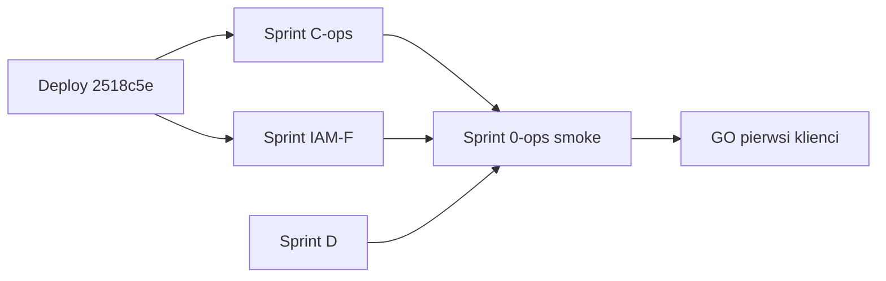

# Proponowane sprinty po wdrożeniu `2518c5e`

> Ostatni commit na `live-release-readiness`: IAM (nav/guard/profile), audyt staff/admin, Sprint C (alerty, backup off-site).  
> Deploy prod: wykonaj lokalnie (SSH z Twojego klucza) — patrz sekcja **Deploy**.

---

## Deploy prod (jednorazowo teraz)

Na serwerze `root@204.168.174.138`, katalog `/opt/verris`:

```bash
cd /opt/verris
git fetch origin live-release-readiness
git checkout live-release-readiness
git pull origin live-release-readiness
git log -1 --oneline   # oczekiwane: 2518c5e

docker compose -f docker-compose.prod.yml --env-file .env.prod up -d --build api client-panel prometheus
bash ops/scripts/prod-migrate-deploy.sh

# Smoke
curl -fsS https://api.verris.pl/healthz && echo OK
curl -fsS https://api.verris.pl/readyz && echo OK
docker compose -f docker-compose.prod.yml --env-file .env.prod ps
```

Opcjonalnie po backupie: włączyć off-site (`docs/SPRINT_C_OPS.md`) i zrestartować prometheus jeśli nie był w `up`.

---

## Mapa sprintów (kolejność rekomendowana)

| Sprint | Nazwa | Priorytet | Cel DONE | Szac. |
|--------|--------|-----------|----------|-------|
| **IAM-F** | IAM follow-up (R-12) | P1 | Pełne subkonta end-to-end | 3–5 dni |
| **C-ops** | Sprint C operacje | P0 | Backup off-site + restore test + Grafana contact | 2–4 dni |
| **D** | Prawne / compliance | P0 (GO klientów) | Dokumenty bez `<TODO>`, lawyer sign-off | 1–2 tyg. |
| **W** | Wallet polish (W-03…) | P2 | UX portfela, staff dual-display | 2–3 dni |
| **0-ops** | Smoke + GO/NO-GO | P0 | `GO_NO_GO_PROD.md` + checklist wypełniony | 1–2 dni |
| **E** | Funkcje opcjonalne | P3 | PayU, rejestrator, AWStats — po decyzji scope | wg scope |

Sprinty produktowe już **wdrożone w kodzie** (utrzymanie tylko): AS-1…3, PC-1…4, Sprint A testy, Sprint B audyt paneli.

---

## Sprint IAM-F — dokończenie IAM (R-12)

Źródło: [`IAM_LIVE_FOLLOWUP.md`](./IAM_LIVE_FOLLOWUP.md).

| Task | Opis |
|------|------|
| IAM-F.1 | Middleware Next — blokada URL subkonta przed hydracją (to samo co `client-nav-access`) |
| IAM-F.2 | Ustawienia subkonta — tylko imię/nazwisko/hasło; ukryć billing firmy i quick links |
| IAM-F.3 | Smoke prod: invite → accept → login → menu + API 403/200 |
| IAM-F.4 | Testy API: `users/me` subaccount, guard hosting-dns pod `/services/...` |
| IAM-F.5 | (Opc.) Presety ról + podgląd audytu IAM w panelu właściciela |

**Kryterium DONE:** ROADMAP R-12 = subkonto widzi i może używać wyłącznie dozwolonych sekcji (UI + API + smoke udokumentowany).

---

## Sprint C-ops — operacje produkcyjne

Źródło: [`SPRINT_C_OPS.md`](./SPRINT_C_OPS.md).

| Task | Opis |
|------|------|
| C.1 | Cron `/etc/cron.d/verris-backup` + log 7 dni bez błędów |
| C.2 | `OFFSITE_ENABLED=1` + rclone/S3 — plik poza serwerem |
| C.3 | Restore test na staging — data i wynik w `PROD_HEALTH_CHECKLIST.md` |
| C.4 | Prometheus ładuje `alerts.yml`; Grafana contact point (Slack/email) |
| C.5 | Wypełnić sekcje 1–12 `PROD_HEALTH_CHECKLIST.md` po pomiarach |
| C.6 | `.env.prod` audit: REDIS_URL, MinIO, SMTP, webhooks, METRICS_AUTH_TOKEN |

**Kryterium DONE:** brak ❌ w checklist; alert test (np. symulacja stale heartbeat na staging).

---

## Sprint D — prawne (LIVE blocker zewnętrzni klienci)

| Task | Opis |
|------|------|
| D.1 | Uzupełnić `docs/legal/drafts/*` (firma, NIP, subprocessors, retencja) |
| D.2 | Lawyer review → publikacja wersji w admin |
| D.3 | Re-consent flow smoke |
| D.4 | `INCIDENT_RESPONSE.md` — kontakt RODO, procedura naruszenia |

**Kryterium DONE:** zero `<TODO>` w treściach widocznych klientowi.

---

## Sprint W — wallet polish (quick)

Z `SPRINT_PLAN.md` § W-03: auto-refresh badge po Stripe, skeleton, staff dual-display PLN/K, mail przy failed auto-topup, badge przy impersonacji.

**Kryterium DONE:** brak „starego salda” po top-up; staff widzi K + zł na profilu klienta.

---

## Sprint 0-ops — smoke i GO

| Task | Opis |
|------|------|
| 0.1 | Pełny smoke: admin/staff/client — zakup, DA, billing, ticket+załącznik, probe, suspend |
| 0.2 | `GO_NO_GO_PROD.md` — wszystkie punkty krytyczne ✅ |
| 0.3 | Uptime badge / restore preview — linki z usług klienta |
| 0.4 | Code review diffu runtime (fetch, cron, HMAC) — zamknięcie Sprint A |

**Kryterium DONE:** kontrolowany LIVE (pierwsi klienci) bez znanych NO-GO.

---

## Sprint E — po decyzji produktowej

Nie blokuje „cichego” LIVE jeśli funkcje nie są promowane. Decyzja: [`LIVE_PRODUCT_SCOPE_DECISION.md`](../LIVE_PRODUCT_SCOPE_DECISION.md).

| Epik | ID | Uwagi |
|------|-----|--------|
| PayU/BLIK | C-13 | Drugi gateway |
| Rejestrator domen | R-13 | Sprzedaż/transfer LIVE |
| Softaculous | R-15 | Instalator WP |
| AWStats/Webalizer | R-19 | Statystyki ruchu |
| AI produkt | — | Tylko po `AI_API_KEY` + decyzja; staff już fail-closed |

---

## Sugerowana kolejność w najbliższych 3 tygodniach



1. **Teraz:** deploy `2518c5e` (Ty na SSH).  
2. **Równolegle:** C-ops (backup/alerty) + IAM-F (middleware + smoke).  
3. **Przed szerokim GO:** Sprint D + 0-ops smoke.  
4. **W:** wallet W-03, Sprint E wg scope.

---

## Powiązane dokumenty

- [`LIVE_READINESS_PLAN.md`](../LIVE_READINESS_PLAN.md)
- [`LIVE_RELEASE_RUNBOOK.md`](../LIVE_RELEASE_RUNBOOK.md)
- [`SPRINT_B_PANEL_AUDIT.md`](./SPRINT_B_PANEL_AUDIT.md)
- [`SPRINT_C_OPS.md`](./SPRINT_C_OPS.md)
- [`IAM_LIVE_FOLLOWUP.md`](./IAM_LIVE_FOLLOWUP.md)
