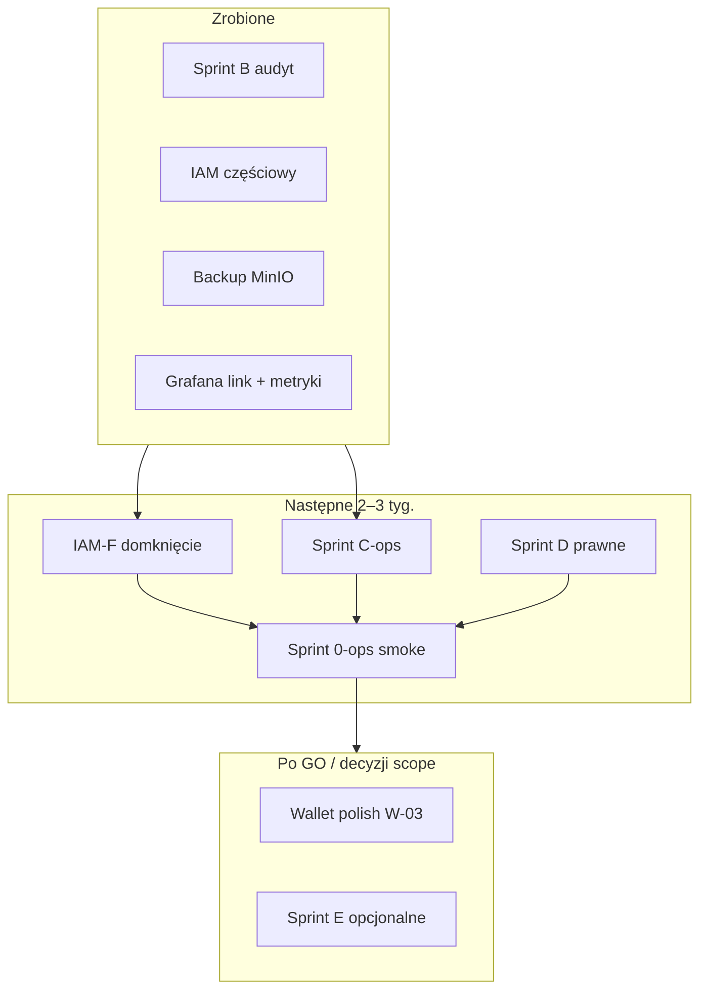

# Proponowane sprinty — stan na 2026-05-22

> Prod HEAD (przybliżenie): `a37476f` + kolejne commity (backup MinIO, IAM middleware, Grafana).  
> Deploy: `ops/scripts/prod-deploy-release.sh` · SSH: `docs/ops/CURSOR_DEPLOY_SSH.md`

---

## Ukończone w ostatnich iteracjach ✅

| Obszar | Co |
|--------|-----|
| IAM (część R-12) | Guard API, nav, middleware, ustawienia subkonta, edycja uprawnień |
| Backup | Postgres → MinIO `verris-backups/postgres/`, cron, restore `--from-minio` |
| Grafana | Metryki backupu, dashboard **Storage & backupy**, alert `VerrisPostgresBackupStale` |
| Panele | Link Grafana w **admin** i **staff** (staff po `canAccessGrafana`) |
| Sprint A/B (kod) | Testy krytyczne, audyt paneli |

---

## Kolejność sprintów (rekomendacja)

---

## Sprint IAM-F — domknięcie R-12 (3–5 dni)

Źródło: [`IAM_LIVE_FOLLOWUP.md`](./IAM_LIVE_FOLLOWUP.md)

| ID | Task | DONE |
|----|------|------|
| IAM-F.1 | Middleware + nav + guard API | ✅ |
| IAM-F.2 | Ustawienia subkonta (bez faktury / quick links) | ✅ |
| IAM-F.3 | **Smoke prod**: invite → accept → login → menu + API | ⏳ |
| IAM-F.4 | Presety ról w UI zaproszenia (support / billing / devops) | ⏳ |
| IAM-F.5 | Podgląd audytu IAM w panelu właściciela | ⏳ |
| IAM-F.6 | Testy integracyjne guard + `users/me` subaccount | częściowo ✅ |

**Kryterium DONE:** smoke udokumentowany + brak regresji na prod.

---

## Sprint C-ops — operacje (2–4 dni)

Źródło: [`SPRINT_C_OPS.md`](./SPRINT_C_OPS.md)

| ID | Task | Stan |
|----|------|------|
| C.1 | Cron backup → MinIO | ✅ cron zainstalowany |
| C.2 | Pierwszy dump w `verris-backups` | ✅ |
| C.3 | Grafana: panel backupu + alert | ✅ |
| C.4 | **Restore test** na staging, wpis w checklist | ⏳ |
| C.5 | Grafana **contact point** (Slack/email) | ⏳ |
| C.6 | Mirror zewnętrzny `backup-mirror-external.sh` | ⏳ faza 2 |
| C.7 | `PROD_HEALTH_CHECKLIST.md` sekcje 1–12 | ⏳ |

---

## Sprint D — prawne (1–2 tyg., blocker zewnętrzni klienci)

| Task | Opis |
|------|------|
| D.1 | Finalizacja `docs/legal/drafts/*` (firma, NIP, subprocessors) |
| D.2 | Lawyer review + publikacja w admin |
| D.3 | Re-consent smoke |
| D.4 | INCIDENT_RESPONSE / RODO kontakt |

---

## Sprint 0-ops — smoke & GO (1–2 dni)

| Task | Opis |
|------|------|
| 0.1 | Pełny smoke LIVE_RELEASE_RUNBOOK (zakup, DA, ticket, billing) |
| 0.2 | `GO_NO_GO_PROD.md` bez NO-GO |
| 0.3 | Linki uptime badge / restore preview z usług klienta |
| 0.4 | Zamknięcie Sprint A (code review runtime) |

---

## Sprint W — wallet polish (2–3 dni, P2)

Z `SPRINT_PLAN.md` § W-03: refresh badge po Stripe, skeleton, staff K+zł, mail auto-topup fail.

---

## Sprint E — po decyzji produktowej (P3)

PayU, rejestrator domen, AWStats, Softaculous, AI produkt — tylko jeśli w ofercie startowej ([`LIVE_PRODUCT_SCOPE_DECISION.md`](../LIVE_PRODUCT_SCOPE_DECISION.md)).

---

## Grafana — konfiguracja

| Element | Wartość |
|---------|---------|
| Dashboard główny (backup row) | `Control plane health` — uid `verris-control-plane` |
| Dashboard storage | **Storage & backupy (MinIO)** — uid `verris-ops-storage` |
| URL w panelach | `NEXT_PUBLIC_GRAFANA_URL` → `/d/verris-ops-storage/verris-ops-storage` |
| Staff dostęp | `canAccessGrafana` (Operatorzy → toggle w admin) |

Metryki Prometheus: `verris_backup_latest_age_seconds`, `verris_backup_present`, `verris_backup_latest_size_bytes`.

---

## Sugerowany następny krok (1 sprint)

**IAM-F.3 smoke** + **C.4 restore test** równolegle — oba zamykają ryzyko przed pierwszymi klientami z subkontami i przed audytem DR.

Potem **Sprint D** i **0-ops smoke** → decyzja GO.

---

## Powiązane dokumenty

- [`LIVE_READINESS_PLAN.md`](../LIVE_READINESS_PLAN.md)
- [`SPRINT_B_PANEL_AUDIT.md`](./SPRINT_B_PANEL_AUDIT.md)
- [`SPRINT_C_OPS.md`](./SPRINT_C_OPS.md)
- [`DEPLOY.md`](../DEPLOY.md) § Grafana, § Backup MinIO
