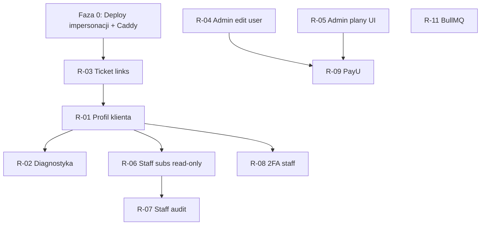

> **ARCHIWUM — dokument nieaktualny.** Zarchiwizowany 2026-08-21 przy porządkowaniu repozytorium po audycie parytetu funkcji.
> **Zastępuje go:** plan 19 sprintów w `plan-startowy-2026-08/PLAN_SPRINTOW_2026-08.md` wraz z backlogiem XLSX. Katalog modułów V-* uratowano do `docs/architektura/MODULY_PRZEWAGI.md`
> Aktualny stan każdej funkcji: `audyt/dane/macierz.csv`. Wartość tego pliku jest wyłącznie historyczna.

---

# Verris — braki, propozycje i plan wdrożenia

> **Cel dokumentu:** jedno miejsce na listę tego, czego brakuje względem **typowego hostingu na rynku** (panel klienta + BOK + operator), **po co** to robimy, **dla kogo** i **w jakiej kolejności** wdrażać.  
> Uzupełnia [`PROJECT_STATUS.md`](./PROJECT_STATUS.md) (co jest DONE) — tutaj skupiamy się na **lukach i roadmapzie produktowej**.

**Ostatnia aktualizacja:** 2026-05-17 (rozszerzenie: migracje, UX per panel, modele AI)  
**Odniesienie architektury:** control-plane (API + DB + 4 panele + status) + węzły compute.

### Integracje zewnętrzne (faktyczny stan)

Verris **nie integruje się** z WHMCS, cPanel, Plesk, Softaculous ani rejestratorem domen jako osobnym produktem. Stack techniczny to:

| Warstwa | Integracja | Rola |
|---------|------------|------|
| Panel hostingowy na węźle | **DirectAdmin** (API) | Konta, domeny, DNS, mail, FTP, SSL, backupy, LVE limity |
| Izolacja zasobów | **CloudLinux LVE** | Limity CPU/RAM/EP/NPROC, autoskalowanie |
| Serwer WWW | **LiteSpeed** | Na węźle (obok DA) |
| Płatności | **Stripe** (+ planowany PayU) | Portfel, subskrypcje, faktury |
| E-mail operacyjny | **SMTP** (Resend / własny) | Tickety, alerty |
| Monitoring | **Prometheus + Grafana** | Metryki, dashboardy (SSO przez API) |

Wzmianki o „WHMCS / home.pl” w tym dokumencie = **benchmark rynkowy** (jak wygląda dojrzały hosting), **nie** planowana integracja.

---

## Legenda

| Symbol | Znaczenie |
|--------|-----------|
| **P0** | Krytyczne dla sensownej pracy BOK / operatora — wdrożyć najpierw |
| **P1** | Standard rynkowy — powinno być w ciągu kilku sprintów po go-live |
| **P2** | Wartość dodana / różnicowanie — po stabilizacji biznesu |
| **S / M / L / XL** | Szacunek effortu (Small → Extra Large) |

**Role:** `USER` (klient), `STAFF` (BOK), `ADMIN` (operator platformy).

---

## 1. Stan obecny (skrót)

### 1.1 Klient (`panel.verris.pl`) — USER

**Ma:** rejestracja, 2FA, zakup usług (portfel/Stripe), lista usług, autoskalowanie, narzędzia hostingowe przez DA (DNS, FTP, mail, SSL, cron, backupy, migracje zewnętrzne), billing + faktury, tickety, częściowy EKO.

**Odczucie „ubogości”:** głównie vs rejestrator domen, 1-click installery, subkonta — nie vs podstawowy shared hosting z DA.

### 1.2 Staff (`staff.verris.pl`) — STAFF

**Ma:** skrzynka ticketów, szczegół ticketu (status, przypisanie, odpowiedzi), lista klientów (CRM), canned responses, **impersonacja → panel klienta** (wdrożone w kodzie — wymaga deploy).

**Odczucie „ubogości”:** brak profilu klienta 360°, brak diagnostyki, brak widoku subskrypcji/węzła bez wchodzenia w impersonację, brak audytu.

### 1.3 Admin (`admin.verris.pl`) — ADMIN

**Ma:** pulpit operacyjny, węzły + DA, subskrypcje (suspend/unsuspend, migracja wewnętrzna), klienci + impersonacja, tickety (podgląd), billing CSV + kredyt portfela + promocje, cennik autoskalowania, status probes/incidents, audyt CSV, Grafana (SSO).

**Odczucie „ubogości”:** słabszy „ekran operatora” per klient (edycja konta, produkty w UI, pełne faktury) niż u dużych hosterów z osobnym panelem billingowym.

### 1.4 Ostatnie poprawki infra (nie funkcje produktowe, ale ważne)

| Temat | Status | Uwagi |
|-------|--------|-------|
| Caddy `CADDY_*_DOMAIN` w kontenerze | ✅ w repo | Bez tego TLS padał na `*.verris.local` |
| Staff: błąd cookie w RSC przy 401 | ✅ w repo | `removeStaffAuthCookie` tylko w Server Actions |
| Staff: impersonacja z CRM | ✅ w repo | API było, brakowało UI |
| `CLIENT_PANEL_URL` w panelach (compose) | ✅ w repo | Redirect impersonacji w prod |

---

## 2. Rejestr braków (macierz)

| ID | Obszar | Brak | Role | Priorytet | Effort | Faza |
|----|--------|------|------|-----------|--------|------|
| R-01 | Staff | Profil klienta 360° (usługi, portfel, tickety, węzeł) | STAFF | P0 | M | 1 |
| R-02 | Staff | Diagnostyka konta (DNS, SSL, logi) | STAFF | P0 | M–L | 1 |
| R-03 | Staff / Admin | Ticket ↔ klient (linki, kontekst) | STAFF, ADMIN | P0 | S | 1 |
| R-04 | Admin | Edycja konta klienta (reset hasła, blokada, email) | ADMIN | P0 | M | 1 |
| R-05 | Admin | UI zarządzania planami (CRUD) | ADMIN | P0 | M | 1 |
| R-06 | Staff | Read-only podgląd subskrypcji klienta | STAFF | P1 | M | 2 |
| R-07 | Staff | Podgląd audytu (własne akcje / per klient) | STAFF | P1 | M | 2 |
| R-08 | Staff | Pełne 2FA na logowaniu (jak klient) | STAFF | P1 | S | 2 |
| R-09 | Billing | PayU / BLIK (drugi gateway) | USER | P1 | L | 2 |
| R-10 | Admin | Faktury i płatności w UI (nie tylko CSV) | ADMIN | P1 | M | 2 |
| R-11 | Provisioning | Kolejka BullMQ (async provision) | SYSTEM | P1 | L | 2 |
| R-12 | Klient | Subkonta / delegacja uprawnień (IAM) | USER | P1 | L | 3 |
| R-13 | Klient | Rejestracja / transfer domen (rejestr) | USER | P1 | XL | 3 |
| R-14 | Klient | Program EKO pełny + referral + badge | USER | P2 | L | 3 |
| R-15 | Klient | Softaculous / WP installer | USER | P2 | L | 3 |
| R-16 | Staff | Zawieszenie usługi / notatka wewnętrzna z staff | STAFF | P2 | M | 3 |
| R-17 | Admin | Role granularne (billing vs infra) | ADMIN | P2 | L | 4 |
| R-18 | AI | Predykcja obciążenia / live chat | STAFF, ADMIN | P2 | XL | 4 |
| R-19 | Klient | Statystyki ruchu (AWStats itp.) | USER | P2 | M | 4 |
| R-20 | Staff | UI migracji wewnętrznej (już jest API) | STAFF | P2 | S | 2 |

*Mapowanie na istniejące ID w `PROJECT_STATUS.md`: R-02 = **E-6**, R-09 = **C-13**, R-11 = **B-7**, R-12 = **E-12**, R-14 = **G-1…G-4**, R-18 = **E-10, E-11**.*

---

## 3. Katalog propozycji (szczegóły)

Każda pozycja: **co robi**, **dla kogo**, **po co**, **dlaczego teraz**, **zależności**.

---

### R-01 — Profil klienta 360° (staff)

| | |
|---|---|
| **Co robi** | Strona `/crm/[userId]`: dane konta, lista subskrypcji (status, plan, węzeł, `daUsername`), saldo portfela, ostatnie tickety, przyciski „Panel klienta” (impersonacja) i „Nowy ticket”. |
| **Dla kogo** | **STAFF** (BOK, support techniczny). |
| **Po co** | Jedno miejsce pracy zamiast skakania: CRM → impersonacja → szukanie w panelu klienta. |
| **Dlaczego** | Impersonacja jest potężna, ale **wolna i inwazyjna** (audyt, 30 min); do 80% pytań wystarczy podgląd read-only. Konkurencja (WHMCS Client Summary) to standard. |
| **Zależności** | API: `GET /admin/users` (jest), `GET /admin/subscriptions?userId=` (może wymagać rozszerzenia API lub filtrowania), tickety po `userId`. |
| **Effort** | M |
| **Kryterium DONE** | Staff widzi klienta bez logowania na jego konto; z ticketu jest link do profilu. |

---

### R-02 — Narzędzia diagnostyczne (staff) — E-6

| | |
|---|---|
| **Co robi** | W profilu klienta lub przy usłudze: test DNS (rekordy vs oczekiwane), status certyfikatu SSL, podgląd ostatnich linii logów/error log konta (z DA lub agenta na węźle). Opcjonalnie: prosty skan AV (jeśli dostępny na węźle). |
| **Dla kogo** | **STAFF** — pierwsza linia supportu. |
| **Po co** | Szybsza diagnoza bez SSH i bez pełnej impersonacji; mniej „proszę o zrzut ekranu”. |
| **Dlaczego** | Zapisane w spec **3.6**, w `PROJECT_STATUS` jako **TODO**; największa luka BOK po ticketach. |
| **Zależności** | DA API / agent na węźle; ewentualnie cache wyników 60 s. |
| **Effort** | M–L |
| **Kryterium DONE** | Staff uruchamia test DNS+SSL dla domeny klienta i widzi wynik w UI &lt; 30 s. |

---

### R-03 — Powiązanie ticket ↔ klient

| | |
|---|---|
| **Co robi** | W szczególe ticketu (staff): blok „Klient” z emailem, linkiem do `/crm/[id]`, przyciskiem impersonacji. W skrzynce: kolumna klient / filtr po emailu. |
| **Dla kogo** | **STAFF**, opcjonalnie **ADMIN** (podgląd ticketów). |
| **Po co** | Kontekst zgłoszenia od razu przy odpowiedzi. |
| **Dlaczego** | Dziś ticket ma dane usera w JSON, ale **nawigacja do CRM/impersonacji nie jest pierwszoplanowa**. |
| **Zależności** | R-01 (profil) opcjonalnie, ale link do CRM może być wcześniej. |
| **Effort** | S |
| **Kryterium DONE** | Z ticketu jeden klik do profilu lub impersonacji. |

---

### R-04 — Edycja konta klienta (admin)

| | |
|---|---|
| **Co robi** | W `/customers` lub `/customers/[id]`: reset hasła (email lub tymczasowe), blokada konta, zmiana emaila (z potwierdzeniem), pole **notatki wewnętrznej** (tylko admin/staff), flagi `canAccessGrafana`. |
| **Dla kogo** | **ADMIN** (ew. STAFF tylko notatka read/write — decyzja produktowa). |
| **Po co** | Operacje codzienne bez SQL i bez „zróbmy seed jeszcze raz”. |
| **Dlaczego** | Admin ma listę i impersonację, ale **nie ma WHMCS-style „Edit Client”**. |
| **Zależności** | API `PATCH /admin/users/:id` (do dodania), audyt każdej zmiany. |
| **Effort** | M |
| **Kryterium DONE** | Admin resetuje hasło klienta; akcja w audit log. |

---

### R-05 — UI planów produktowych (admin)

| | |
|---|---|
| **Co robi** | Sekcja **Plany**: lista planów, edycja limitów LVE (CPU, RAM, dysk, EP, NPROC), cen, powiązanie `stripePriceMonthlyId` / `YearlyId`, włącz/wyłącz plan w sprzedaży. |
| **Dla kogo** | **ADMIN** (product / ops). |
| **Po co** | Zmiana oferty bez migracji SQL i bez `PATCH` z curla. |
| **Dlaczego** | API `GET/POST/PATCH /admin/plans` **istnieje** — brakuje panelu. Przy go-live Stripe Price IDs i tak trzeba ustawiać. |
| **Zależności** | Stripe Dashboard (ceny). |
| **Effort** | M |
| **Kryterium DONE** | Nowy plan lub zmiana ceny możliwa z UI; odzwierciedlone w katalogu klienta. |

---

### R-06 — Staff: read-only subskrypcje

| | |
|---|---|
| **Co robi** | Staff widzi listę subskrypcji klienta, status, plan, węzeł, daty okresu, przycisk „Szczegóły” **bez** suspend/unsuspend (to zostaje u admina). |
| **Dla kogo** | **STAFF**. |
| **Po co** | Odpowiedź na pytania „dlaczego strona nie działa” bez admina. |
| **Dlaczego** | API subskrypcji admin jest **tylko ADMIN**; wymaga `GET /admin/subscriptions?userId=` z `@Roles(STAFF)`. |
| **Zależności** | R-01; zmiana w `subscriptions.admin.controller.ts`. |
| **Effort** | M |
| **Kryterium DONE** | Staff widzi subskrypcje; nie może suspendować. |

---

### R-07 — Staff: podgląd audytu

| | |
|---|---|
| **Co robi** | Zakładka Audyt (ograniczona): ostatnie akcje dla `userId` klienta lub `actorUserId` = zalogowany staff; bez eksportu wrażliwych pól. |
| **Dla kogo** | **STAFF** (superwizja), **ADMIN** (pełny widok już jest). |
| **Po co** | Weryfikacja „czy kolega już impersonował”, śledzenie impersonacji. |
| **Dlaczego** | `GET /admin/audit-logs` dziś **tylko ADMIN**. |
| **Zależności** | R-01; polityka RODO (jakie pola pokazywać). |
| **Effort** | M |
| **Kryterium DONE** | Staff widzi audyt powiązany z klientem; nie widzi sekretów KMS/DA. |

---

### R-08 — 2FA na panelu staff

| | |
|---|---|
| **Co robi** | Ten sam flow co klient: enrollment TOTP, recovery codes, drugi krok przy logowaniu. |
| **Dla kogo** | **STAFF**, **ADMIN** (admin może dzielić ten sam komponent). |
| **Po co** | Konta staff mają dostęp do impersonacji — **wysokie ryzyko** przy samym haśle. |
| **Dlaczego** | API 2FA jest; staff panel pokazuje challenge, ale UX był „kolejny hardening” (E-2). |
| **Zależności** | Wspólny moduł z client-panel settings. |
| **Effort** | S–M |
| **Kryterium DONE** | Staff włącza 2FA; login wymaga kodu. |

---

### R-09 — PayU / BLIK — C-13

| | |
|---|---|
| **Co robi** | Drugi gateway: doładowanie portfela i/lub płatność subskrypcji przez PayU (BLIK, przelewy). |
| **Dla kogo** | **USER** (klienci PL). |
| **Po co** | Część polskiego rynku **nie chce** płacić wyłącznie kartą/Stripe. |
| **Dlaczego** | Ustalenie produktowe: Stripe first, PayU później. |
| **Zależności** | Webhook PayU, reconciliacja z ledgerem. |
| **Effort** | L |
| **Kryterium DONE** | Klient opłaca subskrypcję lub portfel przez BLIK; webhook aktualizuje saldo/status. |

---

### R-10 — Admin: faktury w UI

| | |
|---|---|
| **Co robi** | Lista faktur globalnie i per klient: status, kwota, link hosted/PDF, filtr po dacie/statusie. |
| **Dla kogo** | **ADMIN** (księgowość, support eskalowany). |
| **Po co** | Rozliczenia bez Stripe Dashboard i bez CSV. |
| **Dlaczego** | Klient ma `/billing/invoices`; admin ma głównie **eksport CSV** transakcji. |
| **Zależności** | Model `Invoice` już synchronizowany ze Stripe. |
| **Effort** | M |
| **Kryterium DONE** | Admin wyszukuje fakturę klienta i otwiera PDF/hosted URL. |

---

### R-11 — Provisioning asynchroniczny (BullMQ) — B-7

| | |
|---|---|
| **Co robi** | Po płatności: job `provisioning.create-account` w Redis; klient widzi status „Trwa zakładanie konta…”; retry przy błędzie DA. |
| **Dla kogo** | **USER** (lepsze UX), **SYSTEM** (stabilność). |
| **Po co** | Przy obciążeniu synchroniczny provision **timeoutuje** HTTP i psuje UX. |
| **Dlaczego** | Świadomie odłożone po pierwszym go-live. |
| **Zależności** | `REDIS_URL` w prod już jest. |
| **Effort** | L |
| **Kryterium DONE** | Zakup nie blokuje requestu &gt; 5 s; status provisioningu w UI. |

---

### R-12 — Subkonta klienta (IAM) — E-12

| | |
|---|---|
| **Co robi** | Właściciel konta zaprasza użytkowników z rolami: tylko billing, tylko hosting, tylko tickety. |
| **Dla kogo** | **USER** (firmy, agencje). |
| **Po co** | Standard u klientów B2B; mniej udostępniania jednego hasła. |
| **Dlaczego** | Spec **2.8**; duża zmiana w auth i UI. |
| **Zależności** | Nowe tabele / relacje, zaproszenia email. |
| **Effort** | L–XL |
| **Kryterium DONE** | Zaproszony użytkownik loguje się i widzi tylko dozwolone sekcje. |

---

### R-13 — Rejestracja i transfer domen

| | |
|---|---|
| **Co robi** | Integracja z rejestratorem (API): wyszukiwanie, rejestracja, transfer, odnowienie, DNS w panelu. |
| **Dla kogo** | **USER**, **STAFF** (pomoc przy transferze). |
| **Po co** | Produkt „hosting + domeny” jak home.pl / OVH. |
| **Dlaczego** | Dziś DNS jest pod **istniejącą usługą DA**, nie sprzedaż domen. |
| **Zależności** | Umowa z rejestratorem (np. home.pl, OVH, Dynadot). |
| **Effort** | XL |
| **Kryterium DONE** | Klient kupuje domenę w checkoutcie; pojawia się na usłudze. |

---

### R-14 — Program EKO pełny — G-1…G-4

| | |
|---|---|
| **Co robi** | Tryb EKO: niższe zużycie zasobów, punkty eco, drzewo, generator badge HTML, referral. |
| **Dla kogo** | **USER** (marketing), **ADMIN** (konfiguracja). |
| **Po co** | Różnicowanie marki Verris („zielony hosting”). |
| **Dlaczego** | ~5% etapu G; toggle przy zakupie już jest. |
| **Zależności** | Ledger punktów, reguły naliczania. |
| **Effort** | L |
| **Kryterium DONE** | Klient włącza EKO, zbiera punkty, wgrywa badge na stronę. |

---

### R-15 — Softaculous / instalator 1-click

| | |
|---|---|
| **Co robi** | Instalacja WordPress, Joomla itd. jednym kliknięciem (Softaculous lub własny skrypt). |
| **Dla kogo** | **USER**. |
| **Po co** | Oczekiwanie shared hostingu; mniej ticketów „jak zainstalować WP”. |
| **Dlaczego** | Dziś jest link do DA — wystarczające dla technicznych klientów w pierwszej warstwie LIVE; instalator to kolejny krok. |
| **Zależności** | Licencja Softaculous lub integracja z DA. |
| **Effort** | L |
| **Kryterium DONE** | Klient instaluje WP z panelu na wybranej domenie. |

---

### R-16 — Staff: akcje eskalowane (suspend, notatka)

| | |
|---|---|
| **Co robi** | Notatka wewnętrzna na koncie (widoczna staff+admin). Opcjonalnie: staff może **zawiesić** usługę z wymaganym powodem (audyt). |
| **Dla kogo** | **STAFF** (z polityką), **ADMIN** (pełne prawa). |
| **Po co** | Obcięcie nadużyć / spamu bez czekania na admina. |
| **Dlaczego** | Dziś suspend tylko **ADMIN** — celowo (bezpieczeństwo). |
| **Zależności** | Decyzja produktowa: czy staff może suspend. |
| **Effort** | M |
| **Kryterium DONE** | Notatki działają; suspend według przyjętej polityki. |

---

### R-17 — Role granularne w adminie

| | |
|---|---|
| **Co robi** | Pod-role: `BILLING_ADMIN`, `INFRA_ADMIN`, `SUPPORT_LEAD` z macierzą uprawnień. |
| **Dla kogo** | **ADMIN** (większy zespół). |
| **Po co** | Zasada najmniejszych uprawnień przy rosnącym zespole. |
| **Dlaczego** | Dziś jedna rola ADMIN ma wszystko. |
| **Zależności** | Refactor `RolesGuard`, migracja. |
| **Effort** | L |
| **Kryterium DONE** | Użytkownik z rolą billing nie widzi węzłów. |

---

### R-18 — AI predykcja i live chat — E-10, E-11

| | |
|---|---|
| **Co robi** | (10) Sugestie przeciążenia węzła/klienta na podstawie metryk. (11) Chatbot pierwszej linii z eskalacją do ticketu. |
| **Dla kogo** | **ADMIN** (NOC), **STAFF** (mniej powtarzalnych pytań). |
| **Po co** | Skalowanie supportu bez liniowego hiringu. |
| **Dlaczego** | W spec **4.14–4.15**; wymaga stabilnych danych (D-1 DONE). |
| **Zależności** | Prometheus, polityka AI/RODO. |
| **Effort** | XL |
| **Kryterium DONE** | Prototyp na stagingu z mierzalnym deflection rate. |

---

### R-19 — Statystyki ruchu (AWStats / Webalizer)

| | |
|---|---|
| **Co robi** | Podgląd statystyk WWW per domena w panelu (embed lub proxy z DA). |
| **Dla kogo** | **USER**. |
| **Po co** | „Ile mam odwiedzin” bez osobnego logowania do DA. |
| **Dlaczego** | Standard cPanel; u nas link do DA częściowo zastępuje. |
| **Zależności** | DA API / pliki statystyk na węźle. |
| **Effort** | M |
| **Kryterium DONE** | Klient widzi podstawowe statystyki za ostatni miesiąc. |

---

### R-20 — Staff UI: migracja wewnętrzna między węzłami

| | |
|---|---|
| **Co robi** | Formularz na profilu subskrypcji (staff): wybór węzła docelowego, powód, status joba (jak w adminie). |
| **Dla kogo** | **STAFF** (eskalacje techniczne). |
| **Po co** | API `POST /admin/subscriptions/:id/internal-migration` już pozwala **STAFF** — brakuje tylko UI. |
| **Dlaczego** | Dziś staff musi prosić admina lub używać API ręcznie. |
| **Zależności** | R-06; admin form jako wzór. |
| **Effort** | S |
| **Kryterium DONE** | Staff uruchamia migrację z UI; widzi timeline. |

---

## 4. Plan wdrożenia (fazy)

### Faza 0 — Deploy tego, co już jest w repo (natychmiast)

| Zadanie | Pliki / obszar |
|---------|----------------|
| `git pull` + rebuild `staff-panel`, `client-panel`, `admin-panel`, `caddy` | `docker-compose.prod.yml`, env |
| Zweryfikować `.env.prod`: `CADDY_*`, `CLIENT_PANEL_URL`, `STAFF_PANEL_URL` | `.env.prod.example` |
| Test: impersonacja staff → panel klienta → stop → powrót na `/crm` | E2E ręczny |

**Wyjście:** BOK może wchodzić na konta klientów bez panelu admin.

---

### Faza 1 — „Support może pracować” (P0, ~2–3 tygodnie)

| Kolejność | ID | Deliverable |
|-----------|-----|-------------|
| 1.1 | R-03 | Linki ticket → klient / impersonacja |
| 1.2 | R-01 | `/crm/[userId]` profil 360° (read-only) |
| 1.3 | R-02 | Diagnostyka DNS + SSL (E-6, pełny LIVE) |
| 1.4 | R-04 | Admin: edycja klienta + reset hasła |
| 1.5 | R-05 | Admin: UI planów |

**Wyjście:** Staff i admin nie czują, że „wszystko jest w impersonacji albo w SQL”.

**Metryki sukcesu:**
- Czas od otwarcia ticketu do identyfikacji usługi klienta &lt; 2 min (bez admina).
- 0 zgłoszeń „nie mogę wejść na konto klienta” po deploy fazy 0.

---

### Faza 2 — „Standard hostingu PL” (P1, ~4–6 tygodni)

| Kolejność | ID | Deliverable |
|-----------|-----|-------------|
| 2.1 | R-06 | Staff read-only subskrypcje (API + UI) |
| 2.2 | R-07 | Staff audyt (ograniczony) |
| 2.3 | R-08 | 2FA staff (+ opcjonalnie admin) |
| 2.4 | R-20 | Staff UI migracji wewnętrznej |
| 2.5 | R-10 | Admin faktury w UI |
| 2.6 | R-09 | PayU/BLIK (jeśli priorytet biznesowy) |
| 2.7 | R-11 | BullMQ provisioning (jeśli ruch rośnie) |

**Wyjście:** Porównywalne z małym/średnim hostingiem pod billing i BOK.

---

### Faza 3 — „Produkt dojrzalszy” (P2, backlog)

| ID | Temat |
|----|--------|
| R-12 | Subkonta IAM |
| R-13 | Domeny (rejestr) |
| R-14 | EKO pełny |
| R-15 | Softaculous |
| R-16 | Staff suspend / notatki |
| R-19 | Statystyki ruchu |

---

### Faza 4 — Skala i automatyzacja (P2+, długi horyzont)

| ID | Temat |
|----|--------|
| R-17 | Role granularne |
| R-18 | AI predykcja + chat |

---

## 5. Zależności między fazami (diagram)

---

## 6. Co świadomie NIE robimy w najbliższej fazie

| Temat | Powód |
|-------|--------|
| Osobny produkt billingowy (np. WHMCS) jako integracja | Nie w scope — billing jest w naszym API; rozbudowujemy własny admin |
| Wbudowany file manager zamiast DA | Kosztowny; link do DA wystarcza do Fazy 2 |
| Reseller / multi-brand | Brak wymagania biznesowego |
| AI przed E-6 i profilem 360° | Najpierw ludzie, potem automatyzacja |

---

## 7. Utrzymanie dokumentu

| Kiedy aktualizować | Co zrobić |
|--------------------|-----------|
| Po każdym sprincie | Przenieść zrealizowane ID do `PROJECT_STATUS.md` (DONE) |
| Nowy pomysł od biznesu | Dodać wiersz w sekcji 2 + kartę w sekcji 3 |
| Zmiana priorytetu | Przesunąć fazę / P0–P2 |

**Właściciel dokumentu:** product + tech lead (do ustalenia w zespole).

---

## 8. Szybkie odniesienie: panele vs konkurencja (benchmark rynkowy)

| Funkcja | Typowy duży hoster | Verris dziś | Po Fazie 1 | Po Fazie 2 |
|---------|-------------------|-------------|------------|------------|
| Panel klienta hosting | ✅ | ✅ | ✅ | ✅ |
| Portfel + karty | ✅ | ✅ (Stripe) | ✅ | ✅ (+ PayU) |
| BOK tickety | ✅ | ✅ | ✅+linki | ✅ |
| Impersonacja staff | ✅ | ⚠️ deploy | ✅ UI CRM | ✅ |
| Profil klienta support | ✅ | ❌ | ✅ R-01 | ✅ |
| Diagnostyka DNS/SSL | częściowo | ❌ | ✅ R-02 | ✅ |
| Admin: węzły LVE | ✅ (WHM/root) | ✅ (DA+węzły) | ✅ | ✅ |
| Admin: edycja klienta | ✅ | ❌ | ✅ R-04 | ✅ |
| Admin: plany w UI | ✅ | ❌ | ✅ R-05 | ✅ |
| **Migracja auto (FTP→strona live)** | częściowo (pluginy) | ⚠️ **tylko zgłoszenie** | R-MIG faza 1 | R-MIG faza 2 |
| Rejestr domen | ✅ | ❌ | ❌ | Faza 3 |

---

## 9. Audyt: migracja zewnętrzna klienta (G-6) — co naprawdę działa

### 9.1 Oczekiwanie biznesowe (Twoje pytanie)

> Klient podaje FTP + bazę (+ pocztę), system kopiuje pliki (np. rsync), importuje bazę, konfiguruje pocztę i **uruchamia stronę**.

### 9.2 Faktyczna implementacja (kod: `migration-orchestrator` + `migration-worker.scheduler`)

| Krok | Zaimplementowane? | Szczegóły |
|------|-------------------|-----------|
| Formularz w panelu (`/dashboard/migrations`) | ✅ | Jedno pole **typu źródła na zgłoszenie**: FTP **albo** MySQL **albo** IMAP — nie jeden formularz „pełnej strony” |
| Zapis host/port/user/hasło | ✅ | Hasło szyfrowane (`sourceSecretEnc` w `SubscriptionEvent`) |
| Automatyczny transfer plików (FTP/SFTP/rsync) | ❌ | Brak workera ładującego pliki na konto DA |
| Automatyczny import bazy (mysqldump → DA) | ❌ | Brak |
| Migracja skrzynek IMAP | ❌ | Brak |
| Uruchomienie / weryfikacja strony po migracji | ❌ | Brak health-check „czy WWW działa” |
| Worker cron (`EVERY_MINUTE`) | ✅ częściowo | Tylko: **backup DA** docelowego konta + **utworzenie ticketu TECHNICAL** dla staff + status `MIGRATION_*_QUEUED` |
| Staff widzi hasła źródłowe w tickecie | ❌ (celowo) | W tickecie są metadane; sekret tylko zaszyfrowany w evencie — staff musi go odszyfrować operacyjnie (brak UI do tego) |

**Status produktowy G-6:** w `PROJECT_STATUS.md` oznaczone jako **DONE** = „orchestracja zgłoszenia + backup + ticket”. To **nie** jest samoobsługowa migracja end-to-end.

### 9.3 Migracja wewnętrzna (G-7, między węzłami)

Analogicznie: admin/staff wybiera węzeł docelowy → event → worker robi backup + ticket. **Brak** automatycznego przeniesienia konta DA między serwerami w tle.

### 9.4 Propozycja R-MIG — prawdziwa migracja (przewaga nad konkurencją)

| ID | Co | Dla kogo | Po co | Effort | Model AI |
|----|-----|----------|-------|--------|----------|
| **R-MIG-0** | Uczciwy UX: zmiana copy w formularzu („Zgłoszenie do zespołu” vs „Automatyczna migracja”) | USER | Brak fałszywych oczekiwań | S | `composer-2-fast` |
| **R-MIG-1** | Formularz **pakietowy**: FTP + MySQL + opcjonalnie IMAP w jednym żądaniu; mapowanie domeny docelowej | USER | Jedna akcja zamiast 3 submitów | M | `gpt-5.3-codex` |
| **R-MIG-2** | Worker na węźle: **SFTP/rsync** plików → `public_html` (agent lub kontener job na węźle) | SYSTEM | Właściwy transfer plików | XL | `claude-opus-4-7-thinking-xhigh` |
| **R-MIG-3** | Worker: **mysqldump** ze źródła → import do bazy DA + aktualizacja `wp-config` / URL (WordPress detect) | SYSTEM | Najczęstszy case migracji | L | `claude-opus-4-7-thinking-xhigh` |
| **R-MIG-4** | Worker: **imapsync** (opcjonalnie) dla skrzynek | SYSTEM | Pełna migracja poczty | L | `claude-opus-4-7-thinking-xhigh` |
| **R-MIG-5** | Post-check: HTTP 200 na domenie, wpis w timeline, e-mail „migracja zakończona” / ticket tylko przy błędzie | USER, STAFF | Zamknięcie pętli | M | `gpt-5.3-codex` |
| **R-MIG-6** | Staff UI: podgląd postępu joba + przycisk „retry” / „anuluj” (bez ręcznego FTP) | STAFF | Operacje bez SSH | M | `gpt-5.3-codex` |
| **R-MIG-7** | Panel admin: kolejka migracji globalna (filtrowanie FAILED) | ADMIN | Nadzór | M | `gpt-5.3-codex` |

**Architektura do decyzji (Opus):** joby na węźle przez **agent** (już macie bootstrap + tożsamość węzła) vs **BullMQ** + worker w control-plane z SSH — przy DA+CL najrozsądniej agent na compute-node z sekretami jednorazowymi.

---

## 10. Udogodnienia i urozmaicenia per panel (konkurencja + przewaga)

Legenda: **Konkurencja** = standard u hosterów; **Przewaga** = wyróżnik Verris.

### 10.1 Panel klienta (`panel.verris.pl`)

| ID | Pomysł | Typ | Po co / dla kogo | Priorytet |
|----|--------|-----|------------------|-----------|
| U-01 | **Kreator „Przenieś stronę”** (wizard 4 kroki zamiast surowego formularza) | Konkurencja+ | Mniej porzuceń migracji; USER | P0 (z R-MIG) |
| U-02 | **Status migracji na żywo** (pasek: backup → pliki → baza → DNS → gotowe) | Przewaga | Zaufanie; USER | P0 (z R-MIG) |
| U-03 | **Szybki start WordPress** (1-click przez DA API / CustomBuild) | Konkurencja | Mniej ticketów „jak zainstalować WP” | P1 |
| U-04 | **Podgląd zużycia LVE** na dashboardzie (wykres 24h z `UsageMetric`) | Przewaga | Transparentność vs „ukryte limity”; USER | P1 |
| U-05 | **Powiadomienia** (e-mail: faktura, koniec okresu, autoscaler wyłączony, incydent) | Konkurencja | Retencja; USER | P1 |
| U-06 | **Onboarding po pierwszym zakupie** (checklista: domena → DNS → SSL → backup) | Konkurencja | Time-to-value | P1 |
| U-07 | **Porównanie planów / upgrade w 1 klik** z proration w portfelu | Konkurencja | Upsell; USER | P2 |
| U-08 | **Historia logowań** (z `LoginAttempt` — tylko własne sukcesy) | Konkurencja | Bezpieczeństwo; USER | P2 |
| U-09 | **Dark/light** (obok EKO — osobny motyw) | Udogodnienie | Komfort | P2 |
| U-10 | **Chatbot pierwszej linii** (E-11) | Przewaga | Skala supportu | P2 |
| U-11 | **Kalkulator kosztów migracji** (szacunek GB → czas) | Przewaga | Marketing | P2 |

### 10.2 Panel staff (`staff.verris.pl`)

| ID | Pomysł | Typ | Po co / dla kogo | Priorytet |
|----|--------|-----|------------------|-----------|
| S-01 | **Profil klienta 360°** (R-01) | Konkurencja | Jedno miejsce pracy; STAFF | P0 |
| S-02 | **Skróty klawiszowe** w skrzynce (następny ticket, zamknij, odpowiedz) | Udogodnienie | Szybkość BOK | P1 |
| S-03 | **Szablony odpowiedzi z placeholderami** (`{{clientName}}`, `{{domain}}`) | Konkurencja | Mniej copy-paste | P1 |
| S-04 | **Panel boczny: ostatnie tickety tego klienta** przy odpowiedzi | Konkurencja | Kontekst | P1 |
| S-05 | **Kolejka migracji** (G-6/G-7) z przyciskiem „odszyfruj źródło” (audytowane) | Przewaga | Operacje migracji bez SQL | P0 (z R-MIG) |
| S-06 | **Diagnostyka DNS/SSL** (R-02) | Konkurencja | Mniej eskalacji | P0 |
| S-07 | **SLA timer** na tickecie (pierwsza odpowiedź, czas otwarcia) | Konkurencja | Jakość BOK | P1 |
| S-08 | **Przypisanie auto** (round-robin / najmniej otwartych) — API częściowo w spec | Konkurencja | Sprawiedliwość obciążenia | P2 |
| S-09 | **Widok „co robiłem dziś”** (moje impersonacje, moje odpowiedzi) | Udogodnienie | Superwizja | P2 |
| S-10 | **Integracja ze status page** (aktywny incydent na węźle klienta) | Przewaga | Szybsza diagnoza awarii | P1 |

### 10.3 Panel admin (`admin.verris.pl`)

| ID | Pomysł | Typ | Po co / dla kogo | Priorytet |
|----|--------|-----|------------------|-----------|
| A-01 | **Edycja klienta** (R-04) | Konkurencja | Operacje bez DB; ADMIN | P0 |
| A-02 | **UI planów** (R-05) | Konkurencja | Zmiana oferty; ADMIN | P0 |
| A-03 | **Faktury w UI** (R-10) | Konkurencja | Księgowość | P1 |
| A-04 | **Widok „węzeł pełny”**: CPU/RAM/dysk + lista kont + alerty heartbeat | Konkurencja | NOC; ADMIN | P1 |
| A-05 | **Masowy broadcast** (banner w panelu klienta + status message) | Konkurencja | Komunikacja przy awarii | P2 |
| A-06 | **Promo: limity użyć, daty, plany** — rozszerzenie istniejącego modułu | Konkurencja | Marketing | P2 |
| A-07 | **Raport MRR / churn** (z Postgres + Grafana embed) | Przewaga | Biznes | P2 |
| A-08 | **Jednym klikiem: maintenance mode węzła** (status MAINTENANCE + blokada nowych provisionów) | Przewaga | Bezpieczne prace | P1 |
| A-09 | **Podgląd kolejki provisioning** (B-7 BullMQ gdy będzie) | Konkurencja | Ops | P1 |
| A-10 | **Toggle Grafana per user** w UI (zamiast SQL `canAccessGrafana`) | Udogodnienie | ADMIN | P1 |

### 10.4 Status page + publiczne

| ID | Pomysł | Typ | Po co | Priorytet |
|----|--------|-----|-------|-----------|
| P-01 | **RSS/Atom** dla incydentów | Konkurencja | Subskrypcja statusu | P2 |
| P-02 | **Webhook** (Slack/Discord) przy MAJOR incident | Konkurencja | Szybka reakcja zespołu | P1 |
| P-03 | **Historia planowanych prac** (maintenance calendar) | Konkurencja | Zaufanie | P2 |

### 10.5 Przewagi „ponad konkurencję” (unikalne dla Verris)

| Obszar | Dlaczego możecie wygrać |
|--------|-------------------------|
| **Autoskalowanie LVE w czasie rzeczywistym** z portfelem | Mało hosterów shared ma przejrzysty billing per godzina + guard w UI |
| **Status page powiązany z węzłem klienta** (banner w panelu) | Spójność „mój serwer vs globalny status” |
| **Impersonacja z audytem + 30 min** | Lepsze niż „daj hasło klientowi” |
| **EKO + punkty + badge** (G już w dużej mierze DONE) | Marketing ekologiczny |
| **Prawdziwa migracja 1-click** (po R-MIG) | Hosterzy często tylko „wyślij ticket” — tu realna automatyzacja |

### 10.6 Nowe moduły przewagi do backlogu `V-*`

| ID | Moduł | Panel | Dlaczego warto | Najlepszy moment |
|----|-------|-------|----------------|------------------|
| V-01 | **Health Score usługi** | Klient | Jedna ocena 0-100 pokazuje, czy hosting jest zdrowy: DNS, SSL, backup, incydenty, LVE, PHP | Po diagnostyce i status page |
| V-02 | **Asystent konfiguracji domeny** | Klient | Mniej ticketów po zakupie; klient widzi rekordy, nameservery, propagację, SPF/DKIM/DMARC | Z onboardingiem |
| V-03 | **Backup restore preview** | Klient | Bezpieczniejsze restore: co zostanie nadpisane, z jakiego backupu i z jakim ryzykiem | Po backup/snapshot UX |
| V-04 | **Tryb bezpiecznych zmian** | Klient | Przed SSL/DNS/restore/migracją panel proponuje snapshot i rollback plan | Po backup/snapshot UX |
| V-05 | **Rekomendacje planu/autoscalingu** | Klient | Upsell oparty na danych: czasem upgrade tańszy niż autoscaling | Po wykresach LVE |
| V-06 | **Publiczny uptime badge klienta** | Klient/Publiczne | Klient może pokazać własny uptime, a Verris dostaje wiarygodny branding | Po status page/SLA |
| V-07 | **Centrum domeny bez rejestratora** | Klient | Wartość domenowa bez integracji z rejestrem: DNS, SSL, mail records, nameservery | Przed rejestratorem domen |
| V-08 | **Timeline klienta** | Staff | Jedna oś zakupów, ticketów, płatności, incydentów, impersonacji i zmian technicznych | Po profilu 360 |
| V-09 | **Sugestie odpowiedzi bez AI** | Staff | Rules engine z gotową poradą na podstawie diagnostyki, bez kosztu i ryzyka LLM | Po DNS/SSL diagnostics |
| V-10 | **Runbooki w tickecie** | Staff | Standaryzuje support: checklisty problemów z SSL, DNS, wolną stroną | Po szablonach i diagnostyce |
| V-11 | **Escalation button** | Staff | Eskalacja z automatycznym kontekstem: usługa, węzeł, diagnostyka, logi, incydenty | Po profilu 360 |
| V-12 | **Customer risk flag** | Staff/Admin | Wczesne wykrycie klientów zagrożonych odejściem lub problemami operacyjnymi | Po billing/admin UI |
| V-13 | **Preflight GO-LIVE dashboard** | Admin | Interaktywny `GO_NO_GO_PROD.md`; lepsze niż sama checklista markdown | Sprint stabilizacyjny |
| V-14 | **Capacity planner** | Admin | Prognoza pojemności węzła na podstawie planów, alokacji i realnego usage | Po widoku węzła |
| V-15 | **Anomaly board** | Admin | NOC-lite: spike LVE, failed webhooks, stale heartbeat, failed provisioning, wzrost ticketów | Po metrykach kolejek |
| V-16 | **Incident composer** | Admin | Komunikat status page + banner + mail do dotkniętych klientów z jednego formularza | Po powiadomieniach |
| V-17 | **Changelog / komunikaty produktowe** | Admin/Klient | Profesjonalna komunikacja zmian, prac technicznych i promocji | Po beta |
| V-18 | **Feature flags per klient/plan** | Admin/System | Bezpieczne bety nowych modułów i różnicowanie planów Pro/Business | Przed funkcjami P2 |

---

## 11. Legenda modeli AI (Cursor / agent)

| Model | Kiedy używać | Unikać |
|-------|----------------|--------|
| **`composer-2-fast`** | Małe zmiany UI, copy, linki, env, proste komponenty, fixy typu cookie/redirect | Nowe subsystemy, migracje, płatności |
| **`gpt-5.3-codex`** | Standardowy feature full-stack (API Nest + Next panel), CRUD, formularze, testy jednostkowe | Architektura od zera bez spec |
| **`claude-4.6-sonnet-medium-thinking`** | Średnia złożoność: wiele plików, RBAC, audyt, integracje DA, design API | Bardzo duże greenfield |
| **`claude-opus-4-7-thinking-xhigh`** | Migracja rsync/agent, BullMQ, PayU, IAM, bezpieczeństwo sekretów na węźle, refaktory architektury | Proste teksty w UI |
| **`gpt-5.5-medium`** | Dokumentacja, checklisty testowe, opisy PR, porządkowanie roadmap | Pisanie krytycznego kodu security |

---

## 12. Lista pracy pogrupowana według modelu AI

### 12.1 `composer-2-fast` (szybkie, niskie ryzyko)

| Task | Panel / obszar |
|------|----------------|
| Deploy: Caddy env, `CLIENT_PANEL_URL`, rebuild paneli | Infra |
| R-MIG-0: honest copy na `/dashboard/migrations` | Klient |
| R-03: linki ticket → `/crm/[id]` | Staff |
| Zmiana „CRM” → „Klienci” w nav (jeśli jeszcze nie) | Staff |
| Banner incydentu — doprecyzowanie linku do status | Klient |
| U-09: drobne poprawki UX (loading states, empty states) | Wszystkie |
| A-10: pole Grafana toggle w admin customers (jeśli API gotowe) | Admin |

### 12.2 `gpt-5.3-codex` (standardowy development)

| Task | Panel / obszar |
|------|----------------|
| R-01: `/crm/[userId]` profil 360° (read-only) | Staff |
| R-04: admin edycja użytkownika + reset hasła | Admin |
| R-05: admin UI planów | Admin |
| R-06: staff read-only subskrypcje (API `@Roles` + UI) | Staff + API |
| R-07: staff audyt ograniczony | Staff + API |
| R-08: 2FA staff panel (skopiować wzorzec z klienta) | Staff |
| R-10: admin lista faktur | Admin |
| R-20: staff UI migracji wewnętrznej | Staff |
| S-03: canned responses z placeholderami | Staff |
| S-10: widget incydentu na profilu klienta staff | Staff |
| U-05: powiadomienia e-mail (wykorzystać istniejący mailer) | API + Klient |
| U-06: onboarding checklist (statyczny + API hooks) | Klient |
| P-02: webhook Slack przy MAJOR incident | API |
| R-MIG-1: formularz pakietowy migracji | Klient + API |
| R-MIG-5: post-check HTTP + e-mail | API |
| R-MIG-6: staff UI postępu migracji | Staff |

### 12.3 `claude-4.6-sonnet-medium-thinking` (analiza + średnia złożoność)

| Task | Panel / obszar |
|------|----------------|
| R-02: diagnostyka DNS + SSL (LIVE) | Staff + API |
| R-09: PayU — design integracji + webhook | API |
| R-11: BullMQ provisioning — design kolejki + status UI | API + Klient |
| S-07: SLA na ticketach (schema + UI) | Staff + API |
| A-04: widok węzła „pełny” (agregacja istniejących API) | Admin |
| A-08: maintenance mode flow | Admin + API |
| S-05: staff UI kolejki migracji + bezpieczny podgląd sekretu | Staff |
| U-04: wykres LVE na dashboardzie klienta | Klient + API |

### 12.4 `claude-opus-4-7-thinking-xhigh` (architektura, wysokie ryzyko)

| Task | Panel / obszar |
|------|----------------|
| **R-MIG-2:** agent/worker SFTP/rsync na węzeł compute | Węzeł + API |
| **R-MIG-3:** pipeline mysqldump + import + WP URL replace | Węzeł + API |
| **R-MIG-4:** imapsync opcjonalnie | Węzeł |
| **R-MIG-7:** globalna kolejka migracji + retry/idempotency | API |
| R-12: subkonta IAM | Cały system |
| R-13: rejestrator domen | Integracja zewnętrzna |
| R-17: role granularne admin | API + panele |
| R-18: AI chat / predykcja | Osobny moduł |
| G-7 pełna: automatyczna migracja między węzłami (nie tylko ticket) | Węzeł + API |

### 12.5 `gpt-5.5-medium` (dokumentacja i QA)

| Task | Output |
|------|--------|
| Aktualizacja `PROJECT_STATUS.md` po każdej fazie | Dokumentacja |
| Runbook migracji dla staff (gdy R-MIG-0) | `DEPLOY.md` / wiki |
| Test plan regresji per faza | Checklisty |
| Opisy PR + changelog dla klientów B2B | Komunikacja |

---

## 13. Zaktualizowany plan faz (z migracją)

| Faza | Zakres | Kluczowe ID |
|------|--------|-------------|
| **0** | Deploy repo (impersonacja, env) | infra |
| **1** | BOK + admin operacyjny | R-01…R-05, R-03, S-01, S-06 |
| **1b** | Uczciwość migracji + kolejka staff | R-MIG-0, S-05, R-MIG-1 |
| **2** | Billing PL + ops | R-06…R-11, R-10, R-09 |
| **3** | **Automatyczna migracja** (przewaga) | R-MIG-2…R-MIG-7, U-01, U-02 |
| **4** | Produkt dojrzały | R-12, R-13, R-14, U-03, R-18 |

---

*Ten plik nie zastępuje `PROJECT_STATUS.md` — tam jest status implementacji technicznej; tutaj jest **backlog produktowy i plan wdrożenia**.*
