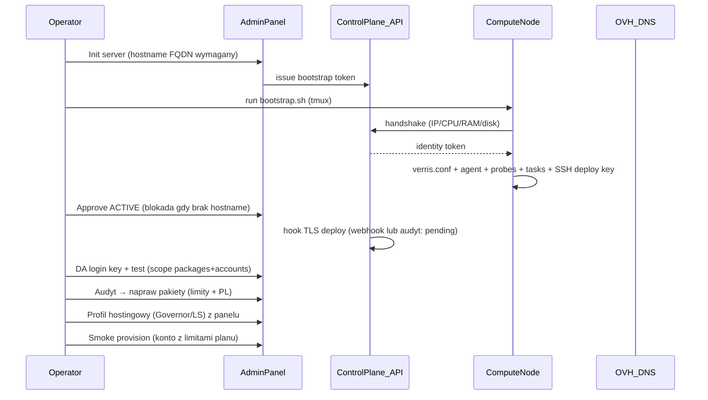

# Node Bootstrap v2 — runbook, flow i Definition of Done

> Zakres: **100% LIVE** (nie MVP). Po instalacji OS + CloudLinux + DirectAdmin +
> LiteSpeed reszta onboardu węzła ma być kompletna, idempotentna i zgodna z
> aktualną dokumentacją vendorów. Ten dokument scala postmortem Node-PL-01,
> docelowy flow, walidatory i checklistę DoD. Powiązany plan:
> `bootstrap_node-pl-01_postmortem`.

---

## 1. Vendor documentation & stack versions (krytyczne — wypełnij przed PR)

Każda zmiana API/skryptów dotykająca pakietów DA, LVE, Governor, CustomBuild i
LiteSpeed musi być oparta o **najnowszą oficjalną dokumentację dla wersji
zainstalowanej na węźle** — nie na pamięć ani stare snippety. Uzupełnij tabelę
„Stack pin” z referencyjnego węzła i odśwież datę weryfikacji przy każdym
większym kroku.

### Stack pin (uzupełnij z węzła)

| Komponent | Wersja na węźle | Polecenie weryfikacji | Sprawdzono (data) |
|-----------|-----------------|------------------------|-------------------|
| OS | _np. AlmaLinux 9.x / 10.2_ | `cat /etc/almalinux-release` | _do uzupełnienia_ |
| CloudLinux | _np. CL 9 / CL 10_ | `cldetect --getuname` / `rpm -q cloudlinux-release` | _do uzupełnienia_ |
| DirectAdmin | _np. 1.67x_ | `/usr/local/directadmin/directadmin version` | _do uzupełnienia_ |
| LiteSpeed | _np. 6.x_ | `/usr/local/lsws/bin/lshttpd -v` | _do uzupełnienia_ |
| LSPHP | _np. 8.3_ | `ls /usr/local/lsws/lsphp*/bin/lsphp` | _do uzupełnienia_ |
| MySQL/MariaDB | _np. MariaDB 10.6_ | `mysql --version` | _do uzupełnienia_ |

### Źródła (otwierać w nowej karcie)

| Obszar | Dokumentacja | Tematy pod bootstrap v2 |
|--------|--------------|--------------------------|
| DirectAdmin API | https://docs.directadmin.com/developer/api/ | `CMD_API_MANAGE_USER_PACKAGES`, `CMD_API_MODIFY_USER`, login keys (scope), `language`, pakiety vs. limity konta |
| DirectAdmin install | https://docs.directadmin.com/directadmin/installation/ | setup.sh, hostname, licencja na IP |
| CloudLinux | https://docs.cloudlinux.com/ | LVE (pakiet vs. konto), `lveinfo`, Governor + MariaDB, CageFS |
| LiteSpeed | https://docs.litespeedtech.com/ | CustomBuild, LSPHP, integracja z DA, serial |

### Zakazane skróty

- Implementacja „na oko” / wg postów sprzed lat bez cross-check z oficjalnym API.
- Zakładanie, że zachowanie Node-PL-01 == dokumentacja (węzeł był ręcznie poprawiany).
- Mieszanie wersji docs DA bez sprawdzenia wersji na serwerze.

> **Atest w UI:** walidatory (`node-audit.service.ts`) zwracają `docAttestation`
> z wersją produktu i datą weryfikacji — ta sama zasada co tabela powyżej.

---

## 2. Zasada 100% LIVE

| Dozwolone | Niedozwolone |
|-----------|--------------|
| Kompletny, idempotentny flow: po CL+DA+LS węzeł osiąga DoD ACTIVE bez ręcznych poprawek pakietów/TLS/SSH/limitów | „Szkielet” z TODO; osobny „docelowy” skrypt na później |
| Realne wywołania API DA, limity z `Plan`, deploy TLS i klucza SSH | Placeholdery, „na razie unlimited”, `console.log` zamiast obsługi błędów |
| Podział na kilka PR — każdy merge gotowy do LIVE w swoim obszarze | Merge „połówki” zostawiającej węzeł gorszym niż przed zmianą |
| Jawne **faza 2** tam, gdzie uzgodnione (custom skin DA) | Etykieta MVP jako usprawiedliwienie braków (limity, locale PL) |

**Gate merge:** nowa akcja skryptu/API bez dopisanej pary walidatorów (istnienie +
zgodność) = nie merge.

---

## 3. Postmortem Node-PL-01 (skrót)

Pierwszy węzeł LIVE: Node-PL-01 (`62.238.0.223`, `node-pl-01.verris.pl`).
Docelowy flow wymagał wielu ręcznych kroków poza skryptem panelu.

| Faza | Co było źle | Skutek |
|------|-------------|--------|
| Bootstrap | nie rejestrował IP w DA, nie tworzył pakietów, brak deploy SSH key | provisioning padał na „Package not found”; TLS ręcznie |
| Onboard | ręczny `scp`, ręczny login key, Governor/MariaDB recovery na EL10 | długi onboard, błędy QUEUED |
| Pakiety DA | tworzone z `u*=yes` → **„Bez ograniczeń”** mimo `quota=…` | rozjazd z planami; klient widzi unlimited |
| Locale | brak ustawienia języka panelu | EN zamiast PL (lub zależne od przeglądarki) |
| TLS | cert na węźle (HTTP-01), potem migracja na CP; wejścia po IP | dwa modele; wildcard nie pokrywa IP |
| Hostname | `daHost` = IP zamiast hostname | linki/health po IP, gorszy TLS |

### Najważniejszy bug: pakiety „Bez ograniczeń”

W API DA pole liczbowe `foo` **razem z** `ufoo=yes` oznacza unlimited i wartość
liczbowa jest ignorowana. Stary payload (`uquota=yes`, `ubandwidth=yes`, …)
dawał puste pola w UI mimo `quota=10240`. **Naprawa:** dla realnych limitów
wysyłać `ufoo=no`. Patrz `libs/directadmin-sdk/src/client.ts → buildPackageParams`.

---

## 4. Mapowanie Plan → pakiet DirectAdmin

Źródło prawdy: `apps/api/src/servers/da-package-spec.ts → buildDaPackageSpecFromPlan`.
Współdzielone przez provisioning (`ensureUserPackage`) i audyt/naprawę
(`upsertUserPackage`). Skrypt węzłowy: `ops/scripts/node-da-sync-plan-packages.sh`.

| Źródło `Plan` | Pole DA | Reguła |
|---------------|---------|--------|
| `diskLimitMb` | `quota` + `uquota=no` | realny MB, nie unlimited |
| `includedTransferGb`×1024 | `bandwidth` + `ubandwidth=no` | unlimited tylko gdy plan nie ma transferu |
| polityka per slug (`packagePolicyForSlug`) | `vdomains`, `nsubdomains`, `nemails`, `nemailf`, `nemailml`, `nemailr`, `mysql`, `domainptr`, `ftp` + `u*=no` gdy liczbowe | starter/pro/business; nieznany slug → bezpieczny default (nie unlimited) |
| `cpuLimit`, `ramLimitMb`, `ioLimitKbps`, `iopsLimit`, `entryProcesses`, `nprocLimit` | LVE pakietu: `cpu`, `mem`, `io`, `iops`, `ep`, `nproc` | **zweryfikuj nazwy pól z wersją DA** (Stack pin) |
| — | `language=pl` | domyślny język panelu (PL) |
| — | `skin=evolution` | do czasu custom skin (faza 2) |

**Polityka liczników (per slug)** — patrz `PACKAGE_POLICY_BY_SLUG`:

| Slug | Domeny | Subdomeny | Skrzynki | Bazy | FTP |
|------|--------|-----------|----------|------|-----|
| starter | 1 | 25 | 25 | 5 | 10 |
| pro | 10 | 100 | 200 | 25 | 50 |
| business | ∞ | ∞ | ∞ | ∞ | ∞ |

**Istniejące węzły:** po zmianie kodu uruchom MODIFY (idempotentny upsert) na
pakietach `starter/pro/business` — przez audyt/naprawę w panelu lub skrypt
`node-da-sync-plan-packages.sh`. Sam create-if-missing **nie** naprawi pakietu
„unlimited”.

### DoD (pakiety)

W DA → Edytuj pakiet `starter`: transfer i dysk **nie** są „Bez ograniczeń”;
LVE zgodne z `Plan`; nowe konto z provisioningu dostaje te same wartości; język PL.

---

## 5. Język panelu DA — PL

- Pakiety i nowe konta: `language=pl` (SDK + skrypt sync).
- Provisioning kont: `createAccount({ language: 'pl' })`.
- **Język serwera/admina** (directadmin.conf) — do ustawienia wg dokumentacji DA
  dla wersji węzła (Stack pin); audyt sprawdza język na poziomie pakietu.

---

## 6. Docelowy flow bootstrap v2

### Entrypoint (decyzja — patrz §8)

- **Bootstrap panelu** (`renderBootstrapScript`): handshake + agent + probes +
  tasks + deploy SSH key. Zostaje jednym entrypointem na węźle.
- **Po ACTIVE**: akcje wykonywane z panelu/API (audyt+naprawa pakietów, profil
  hostingowy jako task agenta, TLS hook) zamiast ręcznego `scp`/SSH.

---

## 7. Walidatory (skrypt → walidator → zgodność → raport)

Model dwufazowy w `apps/api/src/servers/node-audit.service.ts`:

1. **Faza 1 — istnienie/stan:** czy efekt akcji *faktycznie jest* (rekord DB,
   pakiet na liście DA, agent aktywny, cert na :2222).
2. **Faza 2 — zgodność:** czy stan odpowiada `Plan` + spec + dokumentacji
   vendora dla wersji węzła.

API:

- `GET /admin/servers/:id/audit` — read-only `NodeAuditReportDto` (bezpieczny na
  produkcji z klientami).
- `POST /admin/servers/:id/repair/:actionId` — pojedyncza naprawa; `danger`
  wymaga `confirm` = nazwa węzła.

Każdy check zwraca: status (OK/WARN/FAIL/UNKNOWN), **rekordy** (oczekiwane vs.
rzeczywiste), **docAttestation** (vendor, statement, link, data) i — jeśli
istnieje — `repair` z poziomem ryzyka.

| Akcja | Faza 1 | Faza 2 |
|-------|--------|--------|
| Agent/bootstrap | identity token, heartbeat | status ACTIVE, telemetria świeża |
| Deploy SSH key | (na węźle) | zgodność z `VERRIS_NODE_DEPLOY_SSH_PUBKEY` |
| Pakiety DA | pakiet na liście | quota/bandwidth **nie** unlimited; LVE + język = `Plan` |
| Login key DA | API 200 (domeny) | scope packages + accounts |
| daHost | pole w DB | = hostname, nie IP |
| DNS | rekord A | wskazuje IP węzła |
| TLS | cert na :2222 | CN/SAN `*.verris.pl`, nie IP |

---

## 8. Audyt i naprawa istniejących węzłów

Sekcja „Audyt i naprawa” na `/nodes/:id` (komponent `node-audit-panel.tsx`).
Klasyfikacja napraw:

| Poziom | Tryb w UI | Przykłady |
|--------|-----------|-----------|
| **safe** | „Napraw” od razu + rewalidacja; akcja zbiorcza „Napraw wszystkie bezpieczne” | daHost = hostname |
| **caution** | przycisk + potwierdzenie | MODIFY pakietu DA (wpływa na nowe konta) |
| **danger** | ostrzeżenie + wpisanie nazwy węzła | zmiana limitów istniejących kont, rebuild |

Audyt jest **zawsze read-only**; nic ryzykownego nie wykonuje się automatycznie.
Naprawy idempotentne; każda zapisywana w `AuditLog` (`NODE_AUDIT_REPAIR`).

---

## 9. Decyzja: entrypoint (spec-unified-entrypoint)

**Wybór: bootstrap panelu pozostaje jedynym skryptem na węźle**, a kroki
post-ACTIVE są wykonywane przez panel/API i agenta zadań (`verris-tasks`),
nie przez równoległy `node-onboard-live.sh` + ręczny `scp`. Uzasadnienie:

- Login key DA nie może trafić do skryptu bootstrap (sekret, scope) — sync
  pakietów uruchamiamy po skonfigurowaniu DA, z panelu (audyt/naprawa) lub
  skryptem `node-da-sync-plan-packages.sh` z login key operatora.
- Profil hostingowy (Governor/LS) jest już taskiem agenta (`hosting-profile/run`).
- TLS wystawiany centralnie na CP (DNS-01 OVH) — hook po ACTIVE
  (`VERRIS_TLS_DEPLOY_WEBHOOK` lub raport „pending” + komenda dla operatora).

`node-onboard-live.sh` pozostaje narzędziem awaryjnym/ops, nie „docelowym”
stanem LIVE.

---

## 10. Definition of Done — węzeł ACTIVE

(Źródło dla wizarda: `DOD_ACTIVE_CHECKLIST` w `wizard-content.ts`.)

- [ ] Status ACTIVE; agent + sondy zielone (heartbeat < 5 min).
- [ ] Hostname (FQDN) ustawiony; rekord A w OVH → IP węzła.
- [ ] `daHost` = hostname (nie IP) — linki panelu i TLS po hostname.
- [ ] Login key DA: scope packages + accounts (test API OK).
- [ ] Pakiety DA starter/pro/business z realnymi limitami (nie „Bez ograniczeń”),
      język PL.
- [ ] Profil hostingowy (Governor/LiteSpeed) — task SUCCESS.
- [ ] Wildcard `*.verris.pl` na :2222 (CN/SAN, nie IP).
- [ ] Smoke: zakup planu → konto DA z limitami planu.

Każdy punkt ma walidator w sekcji „Audyt i naprawa” — uruchom audyt, by
potwierdzić zgodność z `Plan` i dokumentacją (atest źródła w raporcie).

---

## 11. Non-goals bootstrap v2 (nadal ręcznie / DC)

- Instalacja OS, CloudLinux (`cldeploy`), DirectAdmin `setup.sh` — interaktywne/licencje.
- Eksport `LITESPEED_SERIAL_NO` — sekret operatora.
- Pierwsza konfiguracja OVH API (credentials na CP) — jednorazowo.
- **Custom skin DA** — faza 2 (`ops/docs/DA_CUSTOM_SKIN_ROADMAP.md`).
