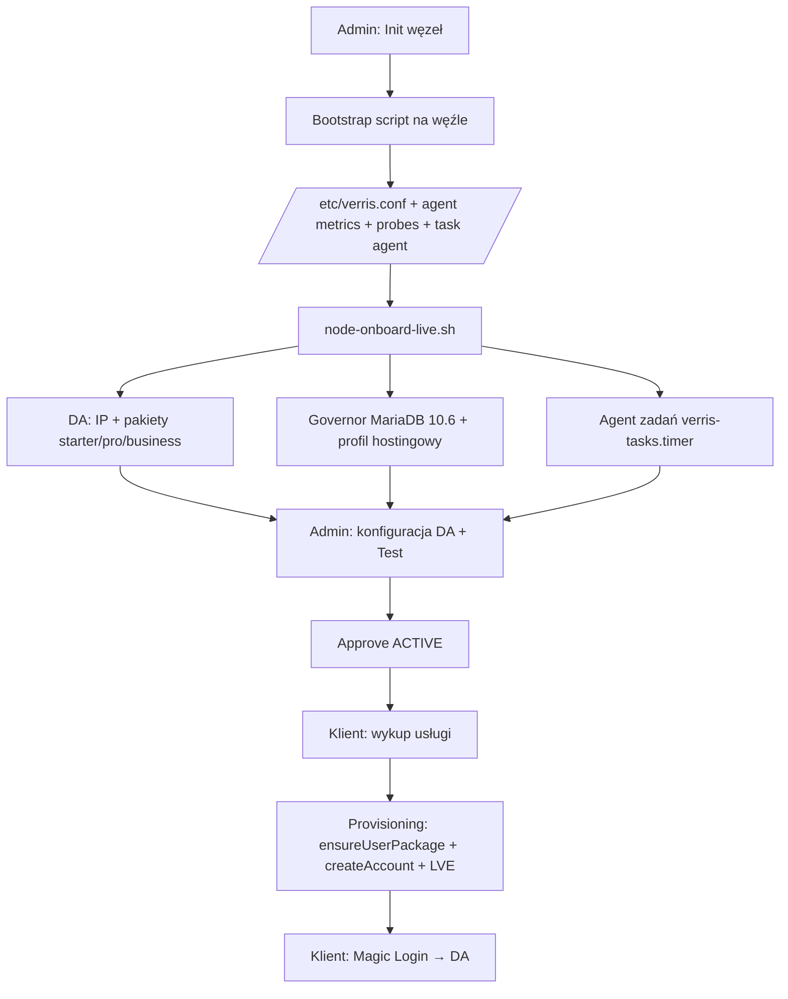

# Onboard węzła compute Verris — runbook LIVE

Dokumentacja kroków bootstrap i onboardingu węzła compute (Node-PL-01 i kolejne).
Cel: **jeden powtarzalny flow** bez ręcznych poprawek między bootstrap a pierwszym provisioningiem.

## Architektura

| Warstwa | Rola |
|--------|------|
| **Control-plane** (`204.168.174.138`) | API, panel admin/klient, PostgreSQL, Redis |
| **Compute node** (np. `62.238.0.223`) | CloudLinux, DirectAdmin, LiteSpeed, agent Verris |
| **Integracja DA** | Admin API (login key) → provisioning; User API (hasło konta) → panel klienta |

## Flow end-to-end



## Faza 1 — Przygotowanie serwera (ręcznie / DC)

1. **OS:** AlmaLinux 10.x + CloudLinux (trial lub licencja).
2. **DirectAdmin:** instalacja standardowa, port **2222**, TLS (self-signed OK).
3. **LiteSpeed:** serial w zmiennej `LITESPEED_SERIAL_NO` (bootstrap może doinstalować).
4. **LSPHP 8.3** pod `/usr/local/lsws/lsphp*/`.
5. **SSH root** + opcjonalnie klucz deploy.

## Faza 2 — Bootstrap Verris (panel admin)

1. Admin → **Węzły** → **Init** → skopiuj skrypt bootstrap.
2. Na węźle jako root:

```bash
export LITESPEED_SERIAL_NO='...'   # jeśli LS jeszcze nie ma
export PUBLIC_IP='62.238.0.223'    # opcjonalnie
bash bootstrap-verris.sh             # skrypt z panelu
```

3. Bootstrap wykonuje:
   - Handshake → `POST /servers/handshake` (token jednorazowy)
   - Zapis **`/etc/verris.conf`** (`VERRIS_API_URL`, `VERRIS_SERVER_ID`, `VERRIS_IDENTITY_TOKEN`)
   - Instalacja **verris-agent** (LVE telemetry co 1 min)
   - Instalacja **verris-probes** (lokalne sondy)
   - Instalacja **agenta zadań** (verris-tasks.timer, verris-task@.service)

4. Admin → **Approve** węzeł (status ACTIVE).

**Krytyczny fix (agent zadań):** unit systemd musi używać `ExecStart=/usr/bin/bash /usr/local/bin/verris-task-run.sh` — skrypt **z shebang** `#!/usr/bin/env bash`. Usunięcie shebang powodowało `203/EXEC`.

## Faza 3 — Onboard LIVE (jeden skrypt)

Skopiuj bundle na węzeł:

```bash
scp -r ops/hosting-default-page \
  ops/scripts/{node-onboard-live,node-live-readiness,node-hosting-profile,\
  install-verris-default-page,node-verris-tasks-install,node-da-sync-plan-packages,\
  verris-tasks,verris-task-run,security-hardening-baseline,security-egress-lockdown}.sh \
  root@WĘZEŁ:/root/verris/
```

Uruchom:

```bash
export DA_USER=admin
export DA_KEY='login-key-z-DA-Account-Manager'
bash /root/verris/node-onboard-live.sh
```

Skrypt `node-onboard-live.sh`:

| Krok | Co robi |
|------|---------|
| Preflight | CloudLinux, DA :2222, LiteSpeed, public IP |
| Security baseline | SSH/fail2ban/sysctl/auto-updates/firewall ingress + egress deny-by-default |
| Wymaga | `/etc/verris.conf` z bootstrapu |
| DA IP | Rejestruje publiczne IP w DA (wymagane przy `ip=` w provisioning — nie `shared`) |
| DA pakiety | `starter`, `pro`, `business` (= `Plan.slug` w panelu) |
| LIVE readiness | Agent zadań + Governor/MariaDB 10.6 + profil hostingowy + weryfikacja |

> Security hardening jest domyślnie **włączony** przy onboardingu.
> Flaga `--skip-security` istnieje tylko awaryjnie (NIEZALECANA dla LIVE).

Logi: `/var/log/verris-node-onboard.log`, `/var/log/verris-live-readiness.log`.

### Governor / MariaDB — typowe problemy (Node-PL-01)

1. Brak użytkownika `mysql` → zainstaluj `cl-MariaDB106-server`.
2. Konflikt meta pakietów MariaDB → `node-hosting-profile.sh` robi reset modułu + recover.
3. Governor „can't connect to socket” → restart `db_governor`, `dbctl list` musi odpowiadać.

## Faza 4 — Konfiguracja DirectAdmin w panelu admin

Węzeł → **DirectAdmin**:

| Pole | Wartość (Node-PL-01) |
|------|----------------------|
| Host | Publiczne IP węzła **lub** hostname węzła (`node-pl-01.verris.pl`) — rekord A musi wskazywać na IP |
| Port | `2222` |
| User | `admin` |
| Password | **Login Key** (nie hasło admina) — scope: packages, accounts |
| TLS | ON (`rejectUnauthorized: false` w SDK) |

**Test połączenia** w panelu → lista domen admina.

Login key: DirectAdmin → Account Manager → Login Keys.

## Faza 5 — Provisioning (API)

Kolejność w `provisioning.service.ts`:

1. `ensureUserPackage(packageName)` — tworzy pakiet DA jeśli brak (slug planu).
2. `createAccount` z **`ip: server.ipAddress`** (fix: wcześniej `shared` → „A valid IP was not provided” na single-IP).
3. `setAccountLimits` — LVE/dysk z planu.
4. Zapis `Account.daPasswordEnc` (hasło konta, szyfrowane KMS).
5. Email `accountProvisionedTemplate` z loginem i hasłem.

### Błędy napotkane na LIVE

| Błąd | Przyczyna | Fix |
|------|-----------|-----|
| `Package not found` | Brak pakietu `starter`/`pro`/`business` na węźle | `node-da-sync-plan-packages.sh` lub `ensureUserPackage` w API |
| `A valid IP was not provided` | `ip: shared` bez puli shared | `resolveDaAccountIp(server)` → `server.ipAddress` |
| Klient nie wchodzi do DA | Hasło tylko przy checkout / mailu | Panel klienta → **Magic Login** (login + hasło + URL) |

## Faza 6 — Dostęp klienta do DirectAdmin

- **URL panelu:** `https://{daHost}:{daPort}` — zwykle `https://62.238.0.223:2222`
- **Login:** `Account.daUsername` (np. `domi3055`)
- **Hasło:** zapisane przy provisioningu — panel klienta → usługa → **Magic Login**
- **Certyfikat:** self-signed DA — przeglądarka wymaga akceptacji wyjątku
- **Brak SSO** do DA z panelu Verris — tylko link + credentials

Weryfikacja techniczna (prod, Node-PL-01):

- Konto `domi3055` / domena `hvln.pl` — **ACTIVE**
- Admin API `SHOW_USER_CONFIG` — OK, `suspended=no`
- User API `SHOW_DOMAINS` — OK (`hvln.pl`)
- Port 2222 dostępny z internetu

## Pliki w repozytorium

| Plik | Opis |
|------|------|
| `ops/scripts/node-onboard-live.sh` | **Główny skrypt onboardingu** (zastępuje ręczną sekwencję) |
| `ops/scripts/node-live-readiness.sh` | Agent + profil + weryfikacja |
| `ops/scripts/node-hosting-profile.sh` | Governor, MariaDB, Exim/Dovecot, FTP, CustomBuild, LiteSpeed |
| `ops/scripts/node-verris-tasks-install.sh` | Instalacja agenta zadań |
| `ops/scripts/node-da-sync-plan-packages.sh` | Pakiety DA = plany |
| `ops/scripts/verris-tasks.sh` | Poll lease zadań |
| `ops/scripts/verris-task-run.sh` | Wykonanie pojedynczego zadania |
| `ops/scripts/security-hardening-baseline.sh` | Bazowy hardening hosta |
| `ops/scripts/security-egress-lockdown.sh` | Egress deny-by-default (nftables) |
| `apps/api/src/servers/servers.service.ts` | Generator bootstrap |
| `apps/api/src/servers/node-tasks-agent.install.ts` | Fragment bootstrap → task agent |
| `apps/api/src/subscriptions/provisioning.service.ts` | Provisioning DA |
| `libs/directadmin-sdk/src/client.ts` | SDK + `ensureUserPackage` |

## Checklist po onboardingu

- [ ] `/etc/verris.conf` istnieje, `curl` lease API OK
- [ ] `systemctl is-active verris-agent.timer verris-tasks.timer`
- [ ] `dbctl list` — Governor OK
- [ ] `mysql -e SELECT 1` — MariaDB OK
- [ ] DA admin test w panelu — OK
- [ ] Pakiety `starter`, `pro`, `business` w DA
- [ ] Publiczne IP w `/usr/local/directadmin/data/admin/ips/`
- [ ] Smoke provisioning → klient widzi dane w Magic Login
- [ ] Port 2222 otwarty w firewallu (CSF: `2222/tcp`)
- [ ] Szablon strony domyślnej Verris w DA (`templates/custom/default` + `admin/domains/default`)

## Kolejne węzły (skrót)

1. Init w panelu admin → bootstrap na serwerze.
2. `scp` bundle → `node-onboard-live.sh` (+ `DA_USER`/`DA_KEY`).
3. Admin: DA config + test + ACTIVE.
4. Smoke usługa.

---

*Ostatnia aktualizacja: onboard Node-PL-01 (`f333c769-dcd5-4013-a11d-261fdda7f127`), provisioning `domi3055` / `hvln.pl`.*
